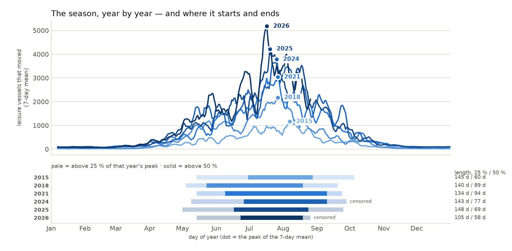
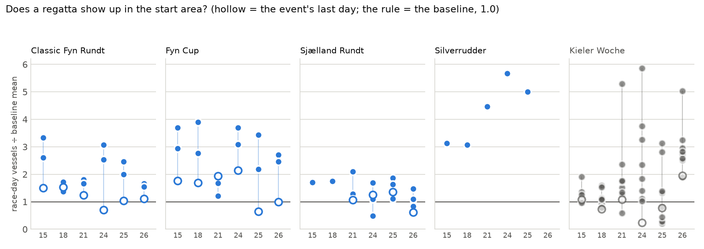
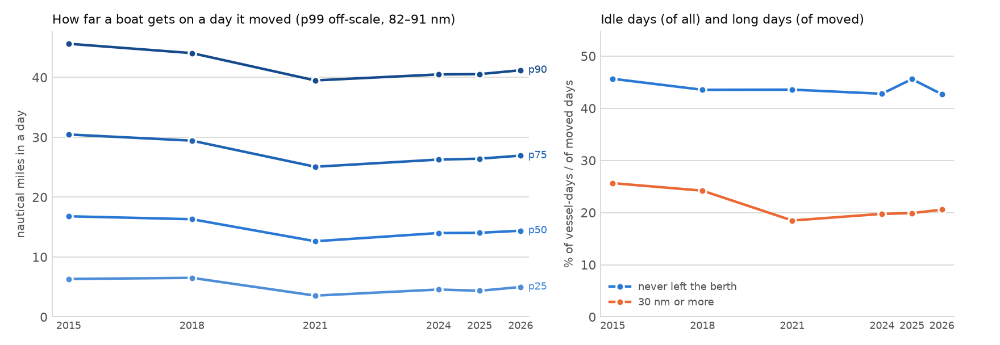

# S6 — chapter 01: the season, the week, the radius

**2 122 days** of the Danish AIS archive, 2015-01-01 → 2026-08-26, from 949
archive files into an 11 GB store: **8 843 467 vessel-days**, of which
2 769 973 are Class B leisure. Six years are loaded whole or nearly whole —
2015, 2018, 2021, 2025 complete, 2024 from 03-01 (the daily archive begins
there), 2026 to 08-26 (the archive's last day) — plus **59 winter days each in
2022 and 2023**, sampled for the storm chapter and *not* a year.

Every number below comes from a query file in `sql/` run through
`scripts/ch.sh`. The three charts and the printed figures are one command:

```bash
uv run --project notes notes/plot_ch01.py
```

It reads the five new S6 query files plus `sql/10_season_daily.sql`, all of
them SELECT-only:

| file | what it answers |
|---|---|
| `sql/10_season_daily.sql` | distinct leisure vessels per day, present and moved |
| `sql/20_season_bounds.sql` | where each year's season starts, peaks and ends |
| `sql/21_weekend_effect.sql` | the weekend, and the Friday-evening departure |
| `sql/22_regatta_spikes.sql` | race-day vessels in the start area vs a baseline |
| `sql/23_radius.sql` | how far a boat gets in a day, and how many days are trips |
| `sql/24_night.sql` | how much movement falls between 22:00 and 05:00 local |

**The fleet** is `mobile = 'Class B' AND ship_group = 'leisure'`. **"Moved"** is
`moving_msgs > 0` — a transponder left on in the marina is not a boat out
sailing (`docs/DECISIONS.md`, 2026-08-30, S3). Times are UTC in the archive;
`Europe/Copenhagen` wherever an hour of day is read.

2022 and 2023 are excluded from all three charts and from every headline number.
They appear only in the caveats, where they earn their keep as a warning.

---

## 1. The season



*`sql/10_season_daily.sql` for the curves (7-day trailing mean computed in
Python — the query's own `active_7d` is partitioned by month, a phase-0
constraint), `sql/20_season_bounds.sql` for the dots and the strip. Pale bar =
days above 25 % of that year's own peak, solid = above 50 %. Years are an
ordered category, so they take a single-hue ordinal ramp, not six categorical
hues; the strip's year ticks are the colour key.*

| year | days | peak of the 7-day mean | 25 % season | 50 % core | censored |
|---|---|---|---|---|---|
| 2015 | 365 | 1 165 on **Aug 7** | May 14 – Oct 5, **145 d** | Jun 30 – Aug 28, **60 d** | — |
| 2018 | 365 | 2 177 on **Jul 27** | May 4 – Sep 20, **140 d** | May 23 – Aug 19, **89 d** | — |
| 2021 | 365 | 3 035 on **Jul 27** | May 14 – Sep 24, **134 d** | Jun 9 – Sep 10, **94 d** | — |
| 2024 | 306 | 3 784 on **Jul 25** | May 8 – Sep 27, **143 d** | Jun 25 – Sep 9, **77 d** | start |
| 2025 | 365 | 4 220 on **Jul 20** | May 1 – Sep 25, **148 d** | Jun 17 – Aug 24, **69 d** | — |
| 2026 | 238 | 5 178 on **Jul 17** | May 14 – **Aug 26**, 105 d | Jun 23 – Aug 19, 58 d | end |

**Finding 1 — the season's edges are fixed and its core is not.**
`sql/20_season_bounds.sql`. Over the four uncensored years the 25 % season sits
at **134, 140, 145 and 148 days** — a spread of 14 days across 11 calendar
years, while the fleet in them grew 3.6× (peak 1 165 → 4 220). The 50 % core
over the same four years is **60, 69, 89 and 94 days** — a spread of 34 days,
two and a half times wider, and it does not move with the fleet size or with
time: 2021 has the longest core (94 d) and 2015 and 2025 the shortest (60 and
69 d). The outer edge of the Danish season is a calendar; its middle is
weather. This is the shape chapter 01 should draw, and it is why the chart
carries both bounds instead of one "season" bar.

**Finding 2 — the peak has walked three weeks earlier, monotonically.**
`sql/20_season_bounds.sql`. The day of the 7-day-mean maximum: **Aug 7 (2015) →
Jul 27 (2018) → Jul 27 (2021) → Jul 25 (2024) → Jul 20 (2025) → Jul 17
(2026)** — 21 days earlier over 11 years, with no reversal in six samples.
2024's peak is inside its loaded range and 2026's is well before its cut, so
neither is a censoring artefact. Six ordered points is not a trend test, and
the note says so; but the direction is the same in every step and the essay may
show it as long as it shows the six dates rather than a fitted line.

---

## 2. The week, and Friday evening

`sql/21_weekend_effect.sql`. No chart — the numbers are the finding.

Distinct leisure vessels that moved, averaged per occurrence of the day:

| year | May–Sep weekday | weekend | ratio | Oct–Apr ratio |
|---|---|---|---|---|
| 2015 | 507.0 | 703.6 | **1.39×** | **1.71×** |
| 2018 | 987.7 | 1 247.5 | **1.26×** | **1.88×** |
| 2021 | 1 378.2 | 1 770.2 | **1.28×** | **1.45×** |
| 2024 | 1 749.3 | 2 254.2 | **1.29×** | **1.49×** |
| 2025 | 1 801.5 | 2 327.9 | **1.29×** | **1.28×** |
| 2026 | 2 342.3 | 2 653.2 | 1.13× (partial) | 1.09× (partial) |

**Finding 3 — the summer weekend is a flat 1.26–1.29× from 2018 on, and the
winter weekend is collapsing.** `sql/21_weekend_effect.sql`. Four consecutive
loaded years — 2018, 2021, 2024, 2025 — give **1.263, 1.284, 1.289, 1.292**:
a spread of 0.029, and the last three are inside 0.008 of each other, while the
mean weekday fleet grew 1.8× (987.7 → 1 801.5). 2015 sits a little higher
at 1.388. The winter ratio does the opposite: **1.71 → 1.88 → 1.45 → 1.49 →
1.28**, and 2026's partial winter is 1.09. Winter used to be much more
weekend-shaped than summer and by 2025 it is not. Whatever the winter fleet is
(S3 found a floor of ~96 vessels moving every January day), it is becoming less
of a Saturday activity — an S10 question, not a claim: the same years grew a
lot of new transponders and the mix may simply have changed.

**Finding 4 — the Friday late start is real, and its premium has shrunk by a
third to a half.**
`sql/21_weekend_effect.sql`. Share of moved leisure vessel-days whose *first
position of the day* arrives after 15:00 local, May–Sep:

| year | Mon–Thu | Fri | Sat | Sun |
|---|---|---|---|---|
| 2015 | 9.78 % | 14.72 % (**1.50×**) | 6.45 % (0.66×) | 5.96 % (0.61×) |
| 2018 | 9.65 % | 14.52 % (**1.50×**) | 6.48 % (0.67×) | 6.07 % (0.63×) |
| 2021 | 10.83 % | 14.69 % (1.36×) | 7.16 % (0.66×) | 6.57 % (0.61×) |
| 2024 | 10.44 % | 13.93 % (1.33×) | 6.96 % (0.67×) | 6.23 % (0.60×) |
| 2025 | 10.26 % | 12.35 % (**1.20×**) | 6.99 % (0.68×) | 5.34 % (0.52×) |
| 2026 | 9.28 % | 12.07 % (1.30×) | 6.31 % (0.68×) | 5.76 % (0.62×) |

Friday runs **1.50× Mon–Thu in 2015 and 2018 and 1.20–1.33× in 2024–2026** —
the premium above a Mon–Thu, +50 %, falls to +20 % (2025) to +33 % (2024) —
while Saturday and Sunday sit at a rock-steady **0.60–0.68×** in every one of
the six years. The weekend days are the control: whatever changed, it changed
on Friday only, which is what "people leave after work on Friday" predicts and
a receiver-coverage story does not.

**This is a proxy, stated as one.** It measures "the first message of the
vessel-day arrives after 15:00 Europe/Copenhagen on a day the boat moved", not
"the boat cast off after 15:00". A Class B set is usually switched on when the
boat leaves, but a boat that sat all afternoon with the electronics on and left
at 19:00 counts as an early start, and a boat that simply came back into
receiver range counts as a late one. The honest quantity — the first hour in
which the vessel moved — is not in the store: `vessel_day` keeps one `first_ts`
per day and `h3_hourly` cannot separate a moving vessel from a stationary one
inside its `uniqExact` state.

---

## 3. The regattas



*`sql/22_regatta_spikes.sql`. Region = the start harbour's res-7 cell plus two
rings (19 cells, ~20 km), so this is the gathering, not the course. Baseline =
the same weekday at −14, −7, +7, +14 days, minus any of those that falls inside
the event's own dates (which only bites on the 9-day Kieler Woche). Hollow marker = the event's last
day. The horizontal rule is the baseline, 1.0. Kieler Woche is drawn
secondary — it is a German event inside a Danish story, and it is the noisy
one.*

**Finding 5 — Silverrudder is the signal: 3.1× → 5.7× while the others stayed
put.** `sql/22_regatta_spikes.sql`. The single-day Svendborg race, race-day
vessels ÷ baseline mean: **3.13 (2015) → 3.08 (2018) → 4.46 (2021) → 5.68
(2024) → 5.00 (2025)**. Nothing else in the file grows like that: Classic Fyn
Rundt's event means wander 1.44–2.48 with no direction, Fyn Cup's 1.61–2.97,
Sjælland Rundt's 1.00–1.75 and *falling* (1.70, 1.75, 1.54, 1.13, 1.49, 1.00).
Silverrudder's baseline is the same weekday in Svendborg two weeks either side
— a September Friday in 2015, 2021, 2024 and 2025, and a **Saturday** in 2018
(2018-09-22, `dow` 6) — with 15–41 vessels in it, so the race is genuinely multiplying a quiet harbour rather than adding to
a busy one. (Silverrudder 2026 is 2026-09-18, after the archive's last day, and
is absent by construction.)

**Finding 6 — the last day of a multi-day regatta is the quiet day.**
`sql/22_regatta_spikes.sql`. Across the 16 multi-day Danish event-years, the
mean first-day ratio is **2.45** and the mean last-day ratio **1.29**; the last
day is the *minimum* of its own event in **12 of the 16**, and is at or below
the baseline in 4 (Classic Fyn Rundt 2024 at 0.70, Fyn Cup 2025 at 0.65 and
2026 at 0.99, Sjælland Rundt 2026 at 0.61). Boats gather before the start and
leave from wherever they finish, so a start-area query sees the arrival and
misses the departure. Any chart that shows "the regatta weekend" as one bar
will average a 2.4× and a 1.3× into a shrug.

**Finding 7 — Kieler Woche 2025's collapsed days are not a receiver gap.**
`sql/22_regatta_spikes.sql`. 2025 has race days at **0.206, 0.280 and 0.443** of
baseline (Jun 24, Jun 27, Jun 28) in the middle of an event that opened at 2.81×
and 3.14×.

*These are not the numbers this note first carried, and the reason was a bug in
the query, not a change in the archive.* Kieler Woche runs nine days and the
baseline is the same weekday at ±7 and ±14 — so for the event's first two and
last two days the ±7 offset landed **inside the event itself**. Jun 28's
baseline contained Jun 21, opening Saturday, with 216 vessels: the race was
being measured against its own opening weekend, which is why its ratio read
0.291. `sql/22_regatta_spikes.sql` now drops any baseline day inside
`[start_date, end_date]`, leaving those four days per Kieler year with
`base_days` 3 instead of 4; only Kieler Woche moves, because every Danish
regatta here is 1–5 days long and no ±7 offset can reach its own range. The
corrected 2025 event reads **2.81, 3.14, 1.33, 0.21, 0.81, 1.38, 0.28, 0.44,
0.78** (mean 1.24, was 1.26). The two deepest dips, Jun 24 (0.206) and Jun 27
(0.280), are mid-event days whose baselines were never contaminated and are
unchanged.

The obvious suspect for the dips is the archive: Kiel is at the far edge of the
Danish receiver footprint. Checked directly — one ad-hoc query, the quiet day
against the same weekday a week earlier, all fleets:

```
scripts/ch.sh -q "
WITH kiel AS (SELECT h3kRing(geoToH3(lat, lon, 7), 2) AS cells FROM regatta
              WHERE place = 'Kiel-Schilksee Olympiahafen' LIMIT 1)
SELECT toDate(hour) AS d, mobile, uniqExactMerge(vessels) AS vessels, sum(msgs) AS msgs,
       uniqExact(h3) AS cells, uniqExact(toHour(hour)) AS hours
FROM h3_hourly WHERE h3 IN (SELECT arrayJoin(cells) FROM kiel)
  AND toDate(hour) IN ('2025-06-17','2025-06-24')
GROUP BY d, mobile ORDER BY d, mobile"

    d      mobile   vessels  msgs   cells hours
2025-06-17 Class A       57  12169     10    24
2025-06-17 Class B       49   2083     12    21
2025-06-24 Class A       70  18820     11    24
2025-06-24 Class B       14    686     12    20
```

The receiver is alive on 2025-06-24: **Class A is up** (70 vessels against 57,
18 820 messages against 12 169, all 24 hours present, one more cell occupied),
and Class B is the only thing that fell (49 → 14). A coverage hole cannot be
class-selective — both classes ride the same shore stations. So the dip is
either real (a lay day, a race sailed outside the 20 km start region, weather)
or an upstream Class B filtering artefact specific to those days; it is **not**
the archive going dark. Verdict for the essay: the number stands, and
Kieler Woche stays a secondary panel — a nine-day event with 13 of its 54 race
days below baseline (13 before the baseline fix as well) is too noisy to carry
a claim either way.

---

## 4. The radius



*`sql/23_radius.sql`. Left: quantiles of `dist_nm` over **moved** vessel-days
only (idle days are all 0 and would drag every quantile down); p99 is off the
scale at 82–91 nm. Right: idle share is of *all* vessel-days, the 30 nm share
is of *moved* days. 2022/2023 excluded.*

| year | vessel-days | idle | p25 | p50 | p75 | p90 | ≥ 30 nm | home in a marina cell |
|---|---|---|---|---|---|---|---|---|
| 2015 | 182 633 | **45.65 %** | 6.33 | **16.80** | 30.46 | 45.61 | **25.64 %** | 82.43 % |
| 2018 | 325 786 | 43.54 % | 6.52 | 16.31 | 29.43 | 44.05 | 24.20 % | 81.93 % |
| 2021 | 478 128 | 43.57 % | 3.55 | 12.63 | 25.07 | 39.49 | 18.48 % | 82.90 % |
| 2024 | 567 905 | 42.78 % | 4.57 | 14.00 | 26.27 | 40.49 | 19.75 % | 82.81 % |
| 2025 | 631 498 | 45.59 % | 4.36 | 14.04 | 26.42 | 40.54 | 19.89 % | 82.88 % |
| 2026 | 545 291 | 42.69 % | 4.99 | 14.39 | 26.93 | 41.19 | 20.56 % | 82.25 % |

**Finding 8 — nearly half of every leisure vessel-day is not a trip, and the
trips that happen got shorter.** `sql/23_radius.sql`. The idle share —
`moving_msgs = 0`, a transponder that reported all day without the boat ever
exceeding 0.5 kn — is **42.7 % to 45.7 %** in every one of the six years, with
no trend across a 3.5× growth in vessel-days. On the days that *are* trips, the
median fell **16.80 nm (2015) → 12.63 nm (2021) → 14.04 nm (2025)** and the
share of days of 30 nm or more fell **25.6 % → 18.5 % → 19.9 %**: the drop
happens between 2018 and 2021 and does not come back. The whole distribution
moved together (p25, p50, p75, p90 all step down in 2021 and all recover
slightly by 2026), which is what a change in *who is in the fleet* looks like,
not a change in what any one boat does. The essay's "half the fleet never
leaves the berth" is defensible; "boats sail less far than they used to" needs
the 2021 step named, not smoothed.

**Finding 9 — 82 % of vessel-days begin in a res-7 cell that holds a marina,
and it is 82 % in every year.** `sql/23_radius.sql`, column
`share_home_in_marina_cell` — added in this session. Its ring-1 sibling
(`share_home_near_marina`, the marina cell plus its six neighbours) is
**91.6–92.3 % in every year including the two winter samples**, i.e. saturated:
at res 7 a ring-1 disc is ~15 km across and the union of 2 833 of them covers
most of the Danish coast, so the measure had stopped separating anything. Ring
0 is the column to quote; it is still remarkably flat (**81.9–82.9 %** over the
six full years — 82.43, 81.93, 82.90, 82.81, 82.88, 82.25 — and 85.9–86.6 % in
the two winter samples), which is the useful negative result: **the growth of
the fleet did not change where a boating day starts.**

**Read the measure literally: "the day's first position falls in a res-7 cell
that contains at least one marina".** Not "the boat was berthed at a marina". A
res-7 cell is ~5 km², so it holds the marina *and* the fishing quay, the
anchorage off the entrance and the moorings across the basin. The control is in
the same table: **Class B fishing satisfies the identical measure at 78.2–81.7 %
(2025: 81.68 %)** and nobody thinks trawlers keep a marina berth — they keep a
harbour. This is a small-vessel harbour signal, and that is all it may be quoted
as. (Class B `other` sits at 57–65 % and Class B `passenger` at 44–94 %, so the
measure does separate something: small harbour craft from everything else.)

```
scripts/ch.sh -q "
WITH mc AS (SELECT DISTINCT h3 FROM marina)
SELECT toYear(day) AS y, ship_group, count() AS vd,
       round(avg(home_h3 IN (SELECT h3 FROM mc)), 4) AS in_marina_cell
FROM vessel_day WHERE mobile = 'Class B'
GROUP BY y, ship_group HAVING vd > 2000 ORDER BY ship_group, y"

fishing  2015 0.8013  2018 0.7848  2021 0.7866  2024 0.8088  2025 0.8168  2026 0.7820
leisure  2015 0.8243  2018 0.8193  2021 0.8290  2024 0.8281  2025 0.8288  2026 0.8225
```

---

## 5. The night

`sql/24_night.sql`. No chart — two columns and a control.

Share of moving messages falling in local hours 22, 23, 00–04:

| year | leisure May–Sep | ferry May–Sep | leisure Oct–Apr | ferry Oct–Apr |
|---|---|---|---|---|
| 2015 | **4.62 %** | 21.25 % | 5.47 % | 20.41 % |
| 2018 | 4.56 % | 20.75 % | 4.13 % | 19.62 % |
| 2021 | 4.79 % | 17.72 % | **7.69 %** | 18.18 % |
| 2024 | 4.65 % | 23.22 % | 8.15 % | 19.49 % |
| 2025 | 4.46 % | 22.85 % | 7.84 % | 20.02 % |
| 2026 | 4.27 % | 22.61 % | 7.03 % | 19.39 % |

**Finding 10 — the leisure night is 4.3–4.8 % against the ferry's 17.7–23.2 %,
and it does not move.** `sql/24_night.sql`. Six summers, eleven years, a fleet
that grew 3.5×, and the summer night share stays inside half a percentage point
— while the ferry control over the same summers swings 5.5 points (17.72 % in
2021 to 23.22 % in 2024). Ferries are the control precisely because their
timetable runs into the night by design: if the two lines moved together the
cause would be the receiver network, and they do not. Danish leisure boating is
a daylight activity with a stability the working fleet does not have. (S3
measured 3.8 % for a July 2025 weekday on the same definition; 4.46 % here is
the whole May–Sep season including weekends, which is consistent.)

**An S10 question, not a finding: the winter night share steps from 0.041–0.055
(2015, 2018) to 0.070–0.082 (2021, 2024, 2025, 2026).** `sql/24_night.sql`. It
is a near-doubling that lands between 2018 and 2021 — the same place the radius
distribution steps in finding 8 — and it is exactly the kind of number a
changing receiver network or a changing transponder population produces. It is
reported here so S10 has to explain it; nothing in chapter 01 should lean on it.

---

## Claim → query

| claim | number | query |
|---|---|---|
| the 25 % season is stable at ~134–148 days | 145 / 140 / 134 / 148 d (uncensored years) | `sql/20_season_bounds.sql` |
| the 50 % core swings 60–94 days | 60 / 89 / 94 / 69 d | `sql/20_season_bounds.sql` |
| the peak moved 3 weeks earlier | Aug 7 2015 → Jul 17 2026 | `sql/20_season_bounds.sql` |
| the summer weekend is flat from 2018 | 1.263 / 1.284 / 1.289 / 1.292× | `sql/21_weekend_effect.sql` |
| the winter weekend is collapsing | 1.71 → 1.88 → 1.45 → 1.49 → 1.28× | `sql/21_weekend_effect.sql` |
| Friday starts late, and less so than it did | 1.50× (2015/18) → 1.20–1.33× (2024–26); Sat/Sun 0.60–0.68× | `sql/21_weekend_effect.sql` |
| Silverrudder grew 3.1× → 5.7× | 3.13 / 3.08 / 4.46 / 5.68 / 5.00 | `sql/22_regatta_spikes.sql` |
| the last race day is the quiet one | first-day mean 2.45, last-day mean 1.29; min of its event in 12 of 16 | `sql/22_regatta_spikes.sql` |
| Kieler Woche 2025's dip is not a coverage hole | Class A 57 → 70 vessels on the quiet day | `sql/22_regatta_spikes.sql` + ad-hoc (§ 3) |
| ~43–46 % of vessel-days never exceed 0.5 kn | 45.65 / 43.54 / 43.57 / 42.78 / 45.59 / 42.69 % | `sql/23_radius.sql` |
| the median trip fell from 16.8 nm | 16.80 → 12.63 → 14.04 nm | `sql/23_radius.sql` |
| long days fell from 25.6 % to ~20 % | 25.64 → 18.48 → 19.89 % | `sql/23_radius.sql` |
| the day starts in a res-7 cell that holds a marina | 81.9–82.9 %; Class B fishing 78.2–81.7 % on the same measure | `sql/23_radius.sql` |
| leisure night ≈ 4.5 %, ferry ≈ 20 % | 4.27–4.79 % vs 17.72–23.22 % (May–Sep) | `sql/24_night.sql` |

---

## Caveats and negative results

**2022 and 2023 are 59 winter days each, not years.** Both windows are
January–February 2022 and February + December 2023. They are excluded from every
chart and every headline claim here. `sql/20_season_bounds.sql` drops them by
rule (`count() >= 200`); `sql/23_radius.sql` and `sql/24_night.sql` report them
and it is the reader's job to skip the rows: a 74–77 % idle share and a 0.05 nm
median are what winter looks like, not what a year looks like.

**The 2022/2023 winter night share (18.4 % and 19.4 %) is a handful of
transponders, not a fleet.** It is the only place where leisure and the ferry
control sit on top of each other, which is the tell. Ad-hoc check, night
moving-messages per res-7 cell over each window (no MMSI touched, and the cell
ids are deliberately not printed here — some of these cells hold one vessel):

```
2022: 2 078 night cells; top 2 cells = 28.6 % of night messages, top 10 = 69.2 %;
      74.2 % comes from cells holding fewer than 5 distinct vessels all window.
2023: 1 756 night cells; top 2 cells = 25.0 % of night messages, top 10 = 63.6 %;
      57.6 % comes from cells holding fewer than 5 distinct vessels all window.
```

The single largest 2022 cell contributes 15.0 % of that winter's night movement
and holds **4** distinct vessels; the largest 2023 cell contributes 13.4 % and
holds **1**. This is a transponder reporting above 0.5 kn all night in one place
— a boat working at anchor, a moored boat surging, or a mislabelled workboat —
and it is why the number is a caveat rather than a finding. It also fails k ≥ 5
by a wide margin, so nothing cell-level from those two windows may ever be
exported.

**Weekend buckets use the UTC date.** `sql/21_weekend_effect.sql` takes the
weekday from `vessel_day.day`, which is a UTC date, so a "Saturday" is the local
window 01:00 Sat → 01:00 Sun (02:00 in summer) and the first one to two local
hours of each day are filed under the previous weekday. `sql/24_night.sql`
bounds that error: the misfilable hours are 00:00–02:00 local, inside a
22:00–05:00 night that holds **4.3–4.8 %** of summer leisure movement in total.
A local-day version is not free — `vessel_day` is built on UTC days, so
`first_ts`, `moving_msgs` and `dist_nm` are all defined against the UTC day, and
re-cutting it would mean re-reading the raw archive, which is deleted.

**2024 and 2026 have censored season bounds.** 2024 holds no January or February
(the daily archive begins 2024-03-01), so its `start_25` (May 8) is a floor, not
a measurement — the true start cannot be earlier than March but the query cannot
see it. 2026 ends 2026-08-26, so its `end_25` *is* the last loaded day and its
105-day season and 58-day core are floors. Both are labelled `censored` by the
query from the data, never from a year list, and both are excluded from finding
1's range. Their peaks (Jul 25 and Jul 17) are inside the loaded ranges and are
real.

**The Sep-2015 duplication is handled and irrelevant here.** The archive
duplicates 2015-08-28 → 2015-09-30 upstream (~2.3× the messages, `docs/STATUS.md`
§ S4-tails). `sql/24_night.sql` excludes the window explicitly and does it *before* its
coverage test, so the window's two edge days cannot slip back in as a 2-hour and
a 22-hour part-day. That costs 2015 34 of its 153 May–Sep local days; a 35th,
2015-06-24, goes to the coverage rule, leaving **118**. The other four queries count distinct vessels
or vessel-days, which a duplicated message cannot move, so nothing else needs an
exclusion — including Silverrudder 2015 (2015-09-18), which sits inside the
window and is trustworthy.

**Negative result: the regatta start region is the wrong instrument for a
round-the-island race.** Finding 6 is the evidence. `sql/22_regatta_spikes.sql`
covers 19 res-7 cells around the start harbour, ~20 km; Sjælland Rundt and
Silverrudder leave that region within hours. It measures the gathering
faithfully and the racing not at all, which is fine for Silverrudder (one
start, one finish, same harbour) and misleading for anything that finishes
elsewhere. A course-following version needs `public_track`, which exists only
for Class A — so for the leisure fleet it cannot be built at all under the
project's privacy rule.

**Negative result: `share_home_near_marina` (ring 1) is dead.** 91.6–92.2 % in
every year, 93.9 % and 95.6 % in the two winter samples — it separates nothing.
That is why `share_home_in_marina_cell` was added to `sql/23_radius.sql` in this
session; the ring-1 column is kept only as the evidence that ring 1 is the wrong
radius, and must not be quoted as "started the day at a marina".

**`sql/20`–`sql/23` count a short UTC day as a whole day.** Two of the 2 122
loaded days hold fewer than 24 hours of `h3_hourly` — **2015-06-24 (21 h) and
2018-05-17 (20 h)**, receiver gaps in the source. Those four queries count
distinct vessels or vessel-days, which a missing hour barely moves (a boat out
sailing reports in the other 20-odd hours too), so no coverage filter is applied
and those 2 days in 2 122 are counted whole. `sql/11`, `sql/12` and `sql/24` do
drop them, because they count messages by hour of the day, where a missing hour
is a hole in the shape — which is why 2015-06-24 is absent from the night
table's 2015 May–Sep row and present everywhere else.

**`sql/24`'s coverage rule drops the spring-forward Sunday, every year.** A
local day with 23 hours fails `uniqExact(hour) = 24` by construction, so
2015-03-29, 2018-03-25 and their siblings are missing from every `Oct-Apr` row.
The rule is inherited from `sql/11_week_profile.sql`; it is stated here, not
fixed — one Sunday in March out of a ~210-day winter, and the fix (a per-day
expected-hour count) is more machinery than the answer is worth.

**Six ordered points are not a trend.** Findings 2, 3, 4, 5 and 8 all describe
directions over six loaded years chosen for coverage, not sampled. Every one of
them states the six numbers so a reader can disagree with the direction; none of
them is fitted, and none should be drawn with a regression line in the essay.
