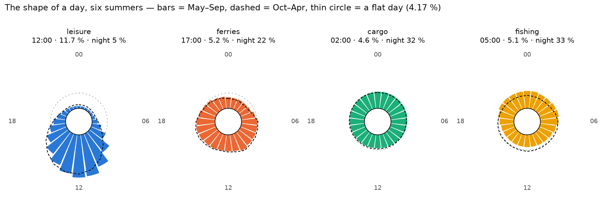
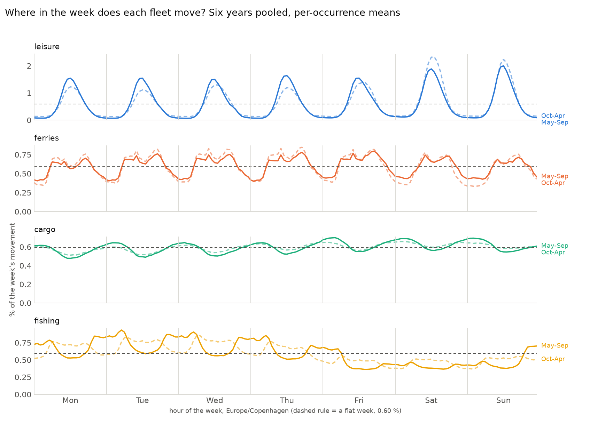
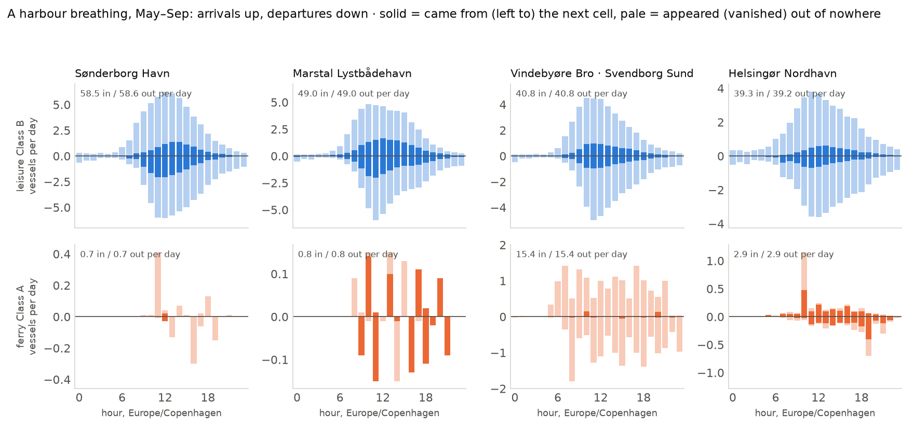

# S7 — chapter 02: the pulse

The same store as chapter 01, unchanged since S5: **2 122 days** of the Danish
AIS archive, 2015-01-01 → 2026-08-26, in an 11 GB `clickhouse local` store. Six
years are loaded whole or nearly whole — 2015, 2018, 2021, 2025 complete, 2024
from 03-01, 2026 to 08-26 — plus **59 winter days each in 2022 and 2023**,
sampled for the storm chapter and *not* a year. After the coverage filter the
six years give **846 covered local days in May–Sep and 1 116 in Oct–Apr**; the
two storm windows add **116 more Oct–Apr days**, which is why `sql/30` and
`sql/32` — which emit a `year` column for the caller to filter on — show 1 232
there, while `sql/31`, which pools the years and emits no `year`, drops them in
SQL and divides by 1 116.

Every number below comes from a query file in `sql/` run through `scripts/ch.sh`.
The three charts and every printed figure are one command:

```bash
uv run --project notes notes/plot_ch02.py
```

| file | what it answers |
|---|---|
| `sql/30_hour_profiles.sql` | the shape of a fleet's day, by year, season and daytype |
| `sql/31_port_breathing.sql` | when a harbour fills and empties, and how a boat got there |
| `sql/32_week_shape.sql` | the 168-hour week, per fleet |
| `sql/33_port_oracle.sql` | the external oracle — one cell-month, both answers side by side |
| `sql/24_night.sql` | S6's night share — read here only as a cross-source check on `sql/30` |
| `sql/10_season_daily.sql` | S3's distinct leisure vessels that moved, per day — § 4 |

**The fleets.** Leisure is `mobile = 'Class B' AND ship_group = 'leisure'` —
the private boats, aggregates only. Ferries are `Class A` + `passenger`, cargo
and fishing `Class A` + their own `ship_group`. Ferries and commercial vessels
are public and are named; no MMSI, name or track of a Class B vessel appears
anywhere in this note, in the script, or in any printed number, and every
cell-level leisure figure quoted here comes from a bucket with **k ≥ 5**
distinct vessels (`sql/31.vessels_seen`, asserted, minimum observed 12).

**Activity is `moving_msgs`**, not vessels: `h3_hourly.vessels` is a `uniqExact`
state over every vessel in the cell-hour, moving or not, and a distinct *moving*
vessel count is not recoverable from it. Class A and Class B report at
completely different rates, so **only the shapes may be compared, never the
heights**. Times are `Europe/Copenhagen` throughout, by timezone name, so they
are DST-correct.

2022 and 2023 are excluded from every chart and every headline number here.
They appear in the caveats, where they earn their keep as a warning. The
exclusion happens in two places: `notes/plot_ch02.py` drops the rows of `sql/30`
and `sql/32`, which emit `year`; `sql/31` has no `year` to drop and excludes the
two windows inside the query.

---

## 1. The four fingerprints



*`sql/30_hour_profiles.sql`. One dial per fleet, six years pooled: midnight at
the top, hours clockwise, radius linear in the hour's share of that fleet's own
day. Bars = May–Sep, dashed outline = Oct–Apr, thin circle = a flat day
(4.17 % an hour). Each fleet is normalised against itself — compare the shapes,
not the sizes. Geometry as prototyped in `site/day-clocks.html`, which is where
the S12 essay page and the S14 animation take it from.*

| fleet | S3 (July 2025 weekday) | six summers, all daytypes | night 22–05 |
|---|---|---|---|
| leisure Class B | 11:00 · 12.1 % · 3.8 % | **12:00 · 11.67 %** | **4.52 %** |
| ferries Class A | 17:00 · 5.1 % · 22.5 % | **17:00 · 5.24 %** | **21.95 %** |
| cargo Class A | 02:00 · 4.8 % · 32.7 % | **02:00 · 4.62 %** | **31.82 %** |
| fishing Class A | 00:00 · 5.6 % · 36.0 % | **05:00 · 5.08 %** | **33.16 %** |

**Finding 11 — the fingerprints survive the jump from one month to six years,
and one of S3's four peak hours does not.** `sql/30_hour_profiles.sql`. Ferries
(17:00) and cargo (02:00) land on exactly the hour S3 measured on a single July
weekday. **Leisure moves from 11:00 to 12:00** — and 12:00 is not a pooling
artefact: it is the peak in all six summers, and in 30 of the 36 (year ×
season × daytype) leisure curves — the other six are 13:00 in five winter
curves (three Saturdays, two weekdays) and 11:00 in one (2025 summer Sunday).
S3's 11:00 is a July
answer; May–Sep peaks an hour later, which is what a season that opens in May
and closes in September should do. **Fishing moves from 00:00 to 05:00** —
which finding 12 says is not a fact about fishing at all.

**Finding 12 — "cargo and fishing peak at night" is true and nearly empty;
leisure is the only fleet with a shape.** `sql/30_hour_profiles.sql`. A flat day
puts 4.167 % in every hour and 29.17 % into a seven-hour night. Measured
against that flat day, six summers:

| fleet | peak ÷ flat | night ÷ flat | trough |
|---|---|---|---|
| leisure | **2.80×** | **0.15×** | 0.57 % at 03:00 |
| ferries | 1.26× | 0.75× | 2.97 % at 01:00 |
| cargo | **1.11×** | **1.09×** | 3.66 % at 12:00 |
| fishing | 1.22× | 1.14× | 3.32 % at 13:00 |

Cargo's entire day lives between 3.66 % and 4.62 % — a curve that never leaves
±12 % of flat. Its argmax falls at 02:00 and that is all "peaks at night" means:
a working ship is a 24-hour machine and the hour of its maximum is not a habit.
The same is true of fishing in summer (1.22× flat) and of the ferries (1.26×).
**Only the leisure fleet has a day**, and its 2.80×/0.15× contrast is the whole
of chapter 02's headline.

---

## 2. Does the leisure hour move?

**Finding 13 — the leisure peak hour is 12:00 and it does not move: not with
the year, not with the day of the week, barely with the season.**
`sql/30_hour_profiles.sql`. Summer, pooled over daytypes: **12:00 in 2015,
2018, 2021, 2024, 2025 and 2026**, at 11.9 / 11.9 / 11.5 / 11.6 / 11.7 / 11.7 %
of the day. Winter, same pooling: 12:00 in five years and 13:00 in 2026. Split
by daytype the same hour holds — summer weekday, Saturday and Sunday all peak
at 12:00 in every year but one. What does change is the **height**: the summer
weekday peak is 11.24–11.60 % against a winter weekday 9.52–10.89 %, and the
winter curve is broader on both flanks (night share 4.52 % → 7.14 %).
Eleven calendar years, a fleet that grew 3.5×, and the busiest hour of a Danish
leisure day is the same hour.

**Negative result: S3's "the Saturday bell sits an hour later than the
weekday's" does not survive.** S3 measured 11:00 on a July weekday and 12:00 on
a July Saturday. Over six summers the weekday, the Saturday and the Sunday all
peak at 12:00, and the Saturday curve is not the broadest of the three either
(§ 3). The S3 observation was a one-hour difference read off one month.

---

## 3. Weekday, Saturday, Sunday

`sql/30_hour_profiles.sql`, May–Sep, six years pooled, leisure Class B:

| daytype | peak | night 22–05 | 06–11 | 12–17 | 18–21 |
|---|---|---|---|---|---|
| weekday | 12:00 · 11.40 % | 4.47 % | 36.74 % | 49.03 % | **8.90 %** |
| Saturday | 12:00 · 11.79 % | **5.20 %** | 35.65 % | 50.91 % | 7.26 % |
| Sunday | 12:00 · **12.66 %** | **4.01 %** | 37.43 % | 51.33 % | **6.42 %** |

**Finding 14 — Sunday is the sharpest leisure day and the quietest night;
Saturday owns the evening and the night.** `sql/30_hour_profiles.sql`. Sunday
puts **12.66 %** of its movement into one hour, more than the Saturday (11.79 %)
or the weekday (11.40 %), and takes the least of any day into the night
(**4.01 %** against Saturday's 5.20 %). The evening runs the other way: 8.90 %
of a weekday's movement falls in 18:00–21:00, 7.26 % of a Saturday's and only
**6.42 %** of a Sunday's. S3's "Sunday's night share is the lowest of all"
holds at six-year scale. The shape it describes is a Sunday that starts, peaks
and finishes earlier than either other kind of day — which § 4 is about.

---

## 4. S3's open question, answered

S3 left one question open: *"Why is Sunday so far above Saturday for leisure in
every month?"* — July 2025, distinct leisure vessels that moved: Sunday 3 690
against Saturday 2 986. The guess on record was **return legs of weekend
trips**. Chapter 02 is the first session with both instruments to test it: the
168-hour week (`sql/32`) for where in the day a difference sits, and S3's own
per-day vessel count (`sql/10`) for whether the difference exists at all.

**Finding 15 — the premise is a July-2025 fact, not a Danish one. Over six
summers Saturday leads Sunday in five of them.** `sql/10_season_daily.sql`,
mean distinct Class B leisure vessels that moved, May–Sep, Sunday ÷ Saturday:
**0.968 (2015), 1.082 (2018), 0.993 (2021), 0.990 (2024), 0.990 (2025), 0.964
(2026)**. July alone is noisier and points both ways: 0.963, **1.297**, 0.937,
0.954, **1.236**, 0.902 — Sunday wins two of the six Julys. July 2025 reproduces
S3 exactly (Sat 2 986, Sun 3 690, ratio 1.236), so nothing has changed in the
store; the sample has. Two months of one year were carrying a claim about
Danish weekends.

**Finding 16 — where the Sunday difference does sit refutes the return-leg
guess: Sunday's excess is in the late morning, and Saturday owns every hour
after 14:00.** `sql/32_week_shape.sql`, May–Sep, six years pooled, mean moving
messages per occurrence of the slot:

| hour | Saturday | Sunday | Sunday − Saturday |
|---|---|---|---|
| 00 | 6 911 | 4 877 | **−2 034** |
| 09 | 55 992 | 57 211 | +1 219 |
| 10 | 79 567 | 84 525 | **+4 958** |
| 11 | 95 304 | 102 636 | **+7 332** |
| 12 | 99 082 | 105 028 | +5 946 |
| 13 | 92 836 | 95 176 | +2 340 |
| 15 | 66 449 | 63 702 | −2 747 |
| 17 | 37 022 | 33 620 | **−3 401** |
| 20 | 11 429 | 9 778 | −1 651 |
| whole day | **840 667** | **829 724** | **−10 943 (−1.3 %)** |

Sunday is above Saturday in exactly five hours of the twenty-four — 09:00 to
13:00 — and below it in the other nineteen, most heavily 15:00–19:00 and right
through the night. Summed, **Sunday carries 1.3 % less leisure movement than
Saturday**, and its excess sits at 00:00–13:00 (+8 648) against a deficit of
−19 591 in 14:00–23:00. A return-leg story predicts a Sunday *afternoon and
evening* excess. The data shows the opposite in both halves.

What the two metrics say together: about as many boats go out on a Sunday as on
a Saturday, they go out an hour or so later in the morning, and by 17:00 the
Sunday fleet is already home while the Saturday fleet is still out. **A Sunday
outing is compressed into the middle of the day.** That is the answer, the
recorded guess was wrong, and the essay may not use it.

*(Both readings are of `moving_msgs`, which counts reports from moving vessels,
not hours afloat. A fleet that is out for fewer hours and a fleet that is out in
smaller numbers produce the same drop; finding 15 is what separates them, and it
says the numbers of boats are equal. That is as far as the aggregates go.)*

---

## 5. The 168-hour week



*`sql/32_week_shape.sql`. Per-occurrence means, six years pooled, renormalised
to a share of the week; solid = May–Sep, dashed = Oct–Apr. The rule is a flat
week, 100/168 = 0.595 % a slot. Slot 0 is Monday 00:00 local.*

**Finding 17 — every fleet's busiest single hour of the week is on a different
day, and fishing's week is the mirror image of leisure's.**
`sql/32_week_shape.sql`. The maximum of the 168-hour week, May–Sep then
Oct–Apr:

| fleet | May–Sep | Oct–Apr |
|---|---|---|
| leisure | **Sun 12:00**, 2.00 % of the week | **Sat 13:00**, 2.33 % |
| ferries | Fri 17:00, 0.80 % | Thu 17:00, 0.85 % |
| cargo | Fri 04:00, 0.70 % | Sat 02:00, 0.66 % |
| fishing | **Tue 05:00**, 0.93 % | Wed 07:00, 0.85 % |

A flat week is 0.595 %, so the leisure maximum is **3.4× flat** and everything
else is within 1.6×. And the day shares run in opposite directions: leisure
takes 16.0 % of its summer week on Saturday and 15.8 % on Sunday against
13.1–14.3 % on the weekdays, while fishing takes **9.8 % on Saturday** — its
weekly *minimum* — against 18.1 % on Tuesday. The fishing fleet takes the
weekend off in the same water where the leisure fleet takes it on. Cargo is
flat to within 13.3–15.2 % across all seven days, in both seasons.

---

## 6. A harbour breathing



*`sql/31_port_breathing.sql`, May–Sep, four of the ten cells. Arrivals up,
departures down, per day. The solid core is the part that was inside the cell's
ring-1 neighbourhood an hour earlier — "came from next door"; the pale
remainder appeared with no trace nearby. Bottom row is the Class A passenger
control in the same cell; three of these ten cells have almost no ferry, which
is why each panel carries its own daily total.*

The ten cells are the busiest leisure cells in Denmark that contain a marina,
ranked on distinct vessels. **Four of the ten — Vindebyøre Bro, Lystbådehavn
Troense, Vindeby Havn and Rantzausminde Lystbådehavn — are four adjacent res-7
cells in one harbour, Svendborg Sund**, and their ring-1 neighbourhoods overlap:
a boat hopping from Troense to Vindeby is an arrival for one and a departure for
the other. **Their four curves must never be added together.** The chart draws
exactly one of them. That a quarter of Denmark's busiest leisure cells is one
sound is itself worth saying out loud — with the caveat that "a quarter" sits on
a `LIMIT 10`: rank 10 holds 8 386 distinct leisure vessels and rank 11 holds
8 268, a gap of 1.4 %, so a top twelve would tell the story with a different
fraction.

**Finding 18 — a leisure harbour inhales between 10:00 and 12:00 and exhales an
hour later, in all ten cells.** `sql/31_port_breathing.sql`, May–Sep. The peak
appearance hour is **10:00, 11:00 or 12:00 in every one of the ten cells**, and
the peak departure hour is 11:00–13:00 — exactly one hour later in seven of the
ten, two hours later at Strib Bådehavn, and the same hour at Dragør and
Sønderborg. Volumes run 26.4 (Gamle Havn) to 58.6
(Sønderborg Havn) appearances a day. Both halves of the breath peak at midday:
this is not a harbour that empties in the morning and refills in the evening,
it is a turnstile whose busiest hours are the middle of the day in both
directions — which is what a Class B fleet whose transponders switch on with the
boat looks like, and what finding 19 measures directly.

**Finding 19 — most of the morning appearance is not a boat sailing in.**
`sql/31_port_breathing.sql`, May–Sep, 08:00–12:00, share of appearances that
were inside the cell's ring-1 neighbourhood an hour earlier:

| cell | appearances 08–12, per day | from the ring | out of nowhere |
|---|---|---|---|
| Sønderborg Havn | 24.70 | 13.0 % | **87.0 %** |
| Marstal Lystbådehavn | 21.99 | 27.1 % | 72.9 % |
| Vindebyøre Bro (Svendborg Sund) | 19.94 | 18.0 % | 82.0 % |
| Helsingør Nordhavn | 15.68 | 11.2 % | **88.8 %** |

Across the whole day and all ten cells the ring share runs **11.3 % (Dragør) to
47.3 % (Vindeby Havn)**. So between half and nine tenths of everything a
res-7 marina cell records as an "arrival" had no trace within ~15 km an hour
earlier. For a leisure fleet that mostly moves at ring-1 speed, that is a
transponder being switched on at the berth, not a boat sailing in.

**Finding 20 — the ferry control proves the ring split is as much a speed test
as a transponder test.** `sql/31_port_breathing.sql`, May–Sep. Vindebyøre Bro —
the Svendborg Sund cell that holds five marinas *and* the Ærø ferry berth —
records **15.4 ferry appearances a day with 3.0 % of them from the ring**.
Helsingør Nordhavn records 2.9 a day with a ring share **well over half** — and
that is as precise as this note will get, because the exact figure is not stable
across sources: `sql/31` reads 62.7 % on `h3_hourly`, and a full-calendar
MMSI-set recomputation of the same quantity from `public_track` reads **76.2 %**
(ad-hoc, same calendar and season, `groupUniqArray(mmsi)` sets, no states). A
4 km crossing spends only minutes outside the ring, so the split is exactly where
a difference in sampling rate lands hardest. **The direction survives and the
percentage does not.** No one believes the Ærø ferry switches its transponder
off between calls. Ring 1 at
res 7 is ~15 km across: the Helsingør–Helsingborg crossing is 4 km and never
leaves it, and a 20 kn ferry crosses it in well under an hour. `arrived_from_ring`
measures *"was still nearby an hour ago"* — which for a leisure boat doing 8 kn
does mean what it says, and for a fast ferry does not. **Read the low ferry ring
shares as speed, never as evidence about ferry transponders.**

**Finding 21 — the harbour does not go dark at night, and how dark it goes is a
property of the cell rather than of the season.** `sql/31_port_breathing.sql`,
May–Sep, `mean_present` at its lowest hour as a share of its highest:
**71 % (Vindebyøre Bro), 70 % (Helsingør Nordhavn), 69 % (Dragør), 66 %
(Sønderborg Havn), 65 % (Marstal)** — but **55 % (Gamle Havn), 42 % (Troense),
32 % (Vindeby Havn), 27 % (Rantzausminde) and 9 % (Strib Bådehavn)**. In the
big cells two thirds of the visible fleet is still visible at 02:00; in Strib
almost none of it is. The night minimum is at 01:00–03:00 in every cell and the
maximum at 09:00–14:00. Whatever `mean_present` counts, it is **not occupancy**:
a berthed boat with the electronics off is invisible and a berthed boat with
them on is not, and the ratio between the two evidently differs by a factor of
eight between one Danish marina cell and another.

---

## 7. Winter against summer

**Finding 22 — fishing changes its clock with the season, cargo does not, and
leisure changes its height but not its hour.** `sql/30_hour_profiles.sql`. Total
variation distance between the May–Sep and the Oct–Apr day curve — the share of
a fleet's movement that would have to be moved to another hour to turn one
season into the other:

| fleet | summer vs winter | peak | night 22–05 |
|---|---|---|---|
| fishing | **11.21 pp** | 05:00 → 07:00 | 33.16 % → **25.01 %** |
| leisure | 6.11 pp | 12:00 → 12:00 | 4.52 % → 7.14 % |
| ferries | 3.40 pp | 17:00 → 17:00 | 21.95 % → 19.58 % |
| cargo | **1.85 pp** | 02:00 → 03:00 | 31.82 % → 30.59 % |

Fishing is the fleet that changes: in summer it works the dark (night share
33.2 %, above a flat day's 29.17 %) and in winter it works the light (25.0 %,
*below* flat, peak at 07:00). Cargo is the fleet that does not: 1.85 pp is
almost nothing, and its peak stays at 02:00–03:00. Leisure keeps its hour and
loses its sharpness — the winter peak is 10.73 % against a summer 11.67 % and
the winter night share is 7.14 % against 4.52 %. **The winter leisure night
share is S6's open question, not a chapter-02 claim**: it steps from
0.041–0.055 (2015, 2018) to 0.069–0.081 (2021 on), which is exactly what a
changing transponder population produces, and S10 owns it.

In the harbours the same season is a factor of ten to twenty: leisure
appearances per day fall from 58.55 to 3.74 at Sønderborg Havn (**15.7×**),
49.01 → 2.76 at Marstal (17.8×), 40.84 → 2.50 at Vindebyøre Bro (16.3×) and
39.27 → 4.49 at Helsingør Nordhavn (**8.7×** — the smallest drop of the four,
and the one cell of the four with a year-round ferry link). The Oct–Apr side of
each ratio is divided by 1 116 covered days, not 1 232: `sql/31` drops the 2022
and 2023 storm windows in SQL, and before it did every winter figure here was
about 7 % low.

---

## Claim → query

| claim | number | query |
|---|---|---|
| the leisure day peaks at 12:00 local, every year | 12:00 in six of six summers, 11.5–11.9 % | `sql/30_hour_profiles.sql` |
| leisure is the only fleet with a shape | peak 2.80× flat, night 0.15× flat | `sql/30_hour_profiles.sql` |
| cargo "peaks at night" by 11 % | peak 1.11× flat, night 1.09× flat | `sql/30_hour_profiles.sql` |
| ferries and cargo hold S3's hour, leisure and fishing do not | 17:00 and 02:00 hold; 11:00 → 12:00, 00:00 → 05:00 | `sql/30_hour_profiles.sql` |
| Sunday is the sharpest day and the quietest night | 12.66 % peak, 4.01 % night vs Saturday 11.79 / 5.20 | `sql/30_hour_profiles.sql` |
| Sunday is *not* above Saturday over six summers | sun/sat 0.968 / 1.082 / 0.993 / 0.990 / 0.990 / 0.964 | `sql/10_season_daily.sql` |
| Sunday's excess is the late morning, not the afternoon | +7 332 at 11:00, −3 401 at 17:00, −1.3 % over the day | `sql/32_week_shape.sql` |
| the leisure week's busiest hour is Sunday 12:00 | 2.00 % of the week, 3.4× flat | `sql/32_week_shape.sql` |
| fishing takes the weekend off | Sat 9.8 % of its week vs Tue 18.1 % | `sql/32_week_shape.sql` |
| a marina cell fills 10:00–12:00 and empties an hour later | 10 of 10 cells; 26.4–58.6 appearances/day | `sql/31_port_breathing.sql` |
| most morning appearances are not boats sailing in | 73–89 % had no trace within ~15 km an hour earlier | `sql/31_port_breathing.sql` |
| the ring split is a speed test | Ærø ferry 3.0 % from the ring, Helsingør ferry over half (62.7 % on `h3_hourly`, 76.2 % on raw positions) | `sql/31_port_breathing.sql` |
| the harbour never goes dark, by a factor that varies 8× | night floor 9 % (Strib) to 71 % (Vindebyøre Bro) of the day peak | `sql/31_port_breathing.sql` |
| fishing changes its clock with the season, cargo does not | 11.21 pp vs 1.85 pp total variation | `sql/30_hour_profiles.sql` |
| `sql/30` and `sql/24` agree | worst 0.0010 (2026 Oct–Apr leisure), May–Sep ≤ 0.0001 | `sql/30` + `sql/24` |
| `sql/31`'s machinery is certified against raw positions, on one cell-month | present 1 646 vs 1 648, appeared 503 vs 502, asserted every run | `sql/33_port_oracle.sql` |

---

## Caveats and negative results

**Only shapes may be compared, never heights.** Activity everywhere in this
chapter is `moving_msgs`. A Class A ship reports every few seconds and a Class B
boat every 30 s at best, so a leisure curve and a cargo curve cannot be put on
one axis as levels — every curve here is normalised against its own fleet's
total. `h3_hourly.vessels` cannot help: it is a `uniqExact` state over every
vessel in the cell-hour, moving or not, and a distinct *moving* vessel count is
not recoverable from it. Where a vessel count was needed (§ 4) it came from
`sql/10_season_daily.sql`, which counts vessel-days, and the two metrics are
kept visibly apart.

**2022 and 2023 are 59 winter days each, not years.** January–February 2022 and
February + December 2023. They are excluded from every chart and every headline.
`sql/30`–`sql/32` emit them and it is the reader's job to skip the rows: their
leisure night share reads 18.3 % and 19.4 %, on top of the ferry control, which
S6 traced to a handful of cells holding fewer than five vessels all window.
Nothing cell-level from those two windows may ever be exported.

**`arrived_from_ring` is as much a speed test as a transponder test.** Finding 20
is the evidence and this is the sentence that must travel with the column: ring 1
at res 7 is ~15 km across, which is one hour at 8 kn and much less than an hour
at 20 kn. Measured on the Svendborg cell in July 2025, with `sql/31`'s own
machinery — 485 of 2 748 leisure appearances from the ring (17.6 %) against 19
of 502 for the ferries (3.8 %). (503 is the *oracle's* appearance total for that
month, not `sql/31`'s; the two differ by one, and finding 20's caveat about
source-sensitive ring shares is the same effect.) **The ferry number is not evidence that ferries switch transponders
off; it is a fast vessel outrunning the ring in an hour.** Getting this backwards
would produce a confident false finding about ferry behaviour.

**Four of the ten cells are one harbour and must not be added together.**
Vindebyøre Bro (`608531604905656319`), Lystbådehavn Troense, Vindeby Havn and
Rantzausminde Lystbådehavn are four adjacent res-7 cells in Svendborg Sund with
overlapping ring-1 neighbourhoods: the same boat is `arrived_from_ring` for one
and `left_to_ring` for another, and is inside two cells' rings at once. Read
them as four views of one sound, or pick one — this note picks Vindebyøre Bro.

**`place` is a landmark, not an inventory.** It names the marina nearest the
cell centre. A res-7 cell is ~5 km across and may hold several marinas plus a
commercial harbour plus a ferry berth: "Vindebyøre Bro" is a cell with **five**
marinas and the Ærø ferry terminal in it. `n_marinas` is the column that says
how coarse the label is; a cell whose marinas are all unnamed in OSM is labelled
`unnamed marina cell`. Marinas are public places and may be named — the privacy
rule is about vessels.

**`mean_present` is a visibility measure, not occupancy.** Finding 21 is the
evidence: the night floor is 71 % of the day peak in one marina cell and 9 % in
another. A berthed boat with its electronics on is present and one with them off
is not, so the column measures how many transponders are radiating, and the
essay must never turn it into "boats in the harbour".

**The coverage rule is repaired for daylight saving in `sql/30`–`sql/32` and
deliberately not in `sql/11`, `sql/12` and `sql/24`.** Those three keep a local
day when it holds 24 distinct local hours, which a 23-hour spring-forward Sunday
fails by construction — so they drop one Sunday in March in every year
(2015-03-29, 2018-03-25, 2021-03-28, 2024-03-31, 2025-03-30, 2026-03-29). The S7
files instead keep a day whose number of distinct **UTC** hours equals the number
of hours the day really has. The three older files are not retrofitted because
their numbers are quoted verbatim in `notes/ch01-findings.md`. The cost of
running two conventions was measured across all 28 (year, season, fleet) rows:
**the worst disagreement is 0.0010** (2026 Oct–Apr leisure, 0.0693 against
0.0703), 2024 Oct–Apr leisure is next at 0.0009, and **every May–Sep row agrees
to 0.0001 or better** — because the day the repair adds back is always a Sunday
in March. That cross-check is printed in full by `notes/plot_ch02.py` and is the
only place in this project where two independently written queries answer the
same question over the same store.

**`sql/32`'s denominator is off by one at Sunday 02:00, and once elsewhere.**
`slot_days` counts weekdays, and one Sunday a year does not have 24 ordinary
hours: on a fall-back Sunday slot 146 takes two UTC hours from one date, on a
spring-forward Sunday it takes none. Measured here: **61 rows of the 23 520 have
`days_seen` one below `slot_days`, never more than one** — 60 of them at slot
146 (Sunday 02:00) and **one at slot 38 (Tuesday 14:00), 2024 Oct–Apr, Class A
leisure**. `sql/32`'s own header says the shortfall is *always* at slot 146; it
is not, and the 61st row is the thin-fleet occupancy case `sql/30`'s header
documents separately (2024 Oct–Apr weekday 14:00, Class A leisure, 107 local
days against 108 for the other nine fleet pairs). The correction does not move
any number in this note — Class A leisure is not one of the four fleets — but
`sql/32`'s header should be amended before S12 quotes it.

**`sql/31`'s Σappeared = Σvanished check is run on rounded means.** The file
emits `mean_appeared` rounded to two decimals, so 24 hours carry up to 0.12 a day
of rounding in each column. `notes/plot_ch02.py` therefore asserts
`|Σappeared − Σvanished| < 0.05 × Σappeared + 0.24` per (cell, fleet, season)
rather than the pure 5 % the brief asked for: without the additive term the
near-empty ferry buckets fail on rounding alone (Lystbådehavn Troense records
0.06 ferry appearances a day against 0.09 departures — some fifty ferry-hours in
846 days, every one of them a rounded 0.00 or 0.01). The exact raw residuals
cannot be recovered from the committed file at all, since it only ever emits the
rounded means. One ad-hoc query — `sql/31`'s machinery with the rounding, the
labels and the season split taken out — prints them:

```
scripts/ch.sh -q "
WITH base AS (
    SELECT hour, toTimeZone(hour, 'Europe/Copenhagen') AS lt, h3, mobile, ship_group, vessels
    FROM h3_hourly
    WHERE NOT (hour >= toDateTime('2015-08-28 00:00:00','UTC')
           AND hour <  toDateTime('2015-10-01 00:00:00','UTC'))
      AND toYear(toTimeZone(hour,'Europe/Copenhagen')) NOT IN (2022, 2023)),
covered AS (SELECT toDate(lt) AS lday FROM base GROUP BY lday
    HAVING uniqExact(hour) = dateDiff('hour', toStartOfDay(min(lt)), toStartOfDay(min(lt)) + INTERVAL 1 DAY)),
cells AS (SELECT h3 FROM base WHERE mobile='Class B' AND ship_group='leisure'
    AND h3 IN (SELECT DISTINCT h3 FROM marina) GROUP BY h3 ORDER BY uniqExactMerge(vessels) DESC LIMIT 10),
ring AS (SELECT h3 AS cell, arrayJoin(h3kRing(h3,1)) AS member FROM cells),
per AS (SELECT r.cell AS cell, if(b.mobile='Class B','leisure','ferry') AS fleet, b.hour AS hour,
        uniqExactMergeStateIf(b.vessels, b.h3=r.cell) AS own_st, uniqExactMergeIf(b.vessels, b.h3=r.cell) AS own_n
    FROM base AS b INNER JOIN ring AS r ON b.h3=r.member
    WHERE b.h3 IN (SELECT member FROM ring)
      AND ((b.mobile='Class B' AND b.ship_group='leisure') OR (b.mobile='Class A' AND b.ship_group='passenger'))
    GROUP BY cell, fleet, hour),
u AS (SELECT cell, fleet, hour + k*3600 AS slot, uniqExactMerge(own_st) AS un
    FROM per ARRAY JOIN [0,1] AS k GROUP BY cell, fleet, slot),
ev AS (SELECT g.cell AS cell, g.fleet AS fleet, n.own_n AS n_now, p.own_n AS n_prev,
        n_now + n_prev - g.un AS i_own, n_now - i_own AS appeared, n_prev - i_own AS vanished
    FROM u AS g
    LEFT JOIN per AS n ON n.cell=g.cell AND n.fleet=g.fleet AND n.hour=g.slot
    LEFT JOIN per AS p ON p.cell=g.cell AND p.fleet=g.fleet AND p.hour=g.slot-3600
    WHERE toDate(toTimeZone(g.slot,'Europe/Copenhagen')) IN (SELECT lday FROM covered))
SELECT m.place AS place, ev.fleet AS fleet, sum(appeared) AS app, sum(vanished) AS van, app-van AS residual
FROM ev INNER JOIN (SELECT h3, argMinIf(name, geoDistance(toFloat32(lon),toFloat32(lat),
        toFloat32(h3ToGeo(h3).2),toFloat32(h3ToGeo(h3).1)), name!='') AS place
    FROM marina WHERE h3 IN (SELECT h3 FROM cells) GROUP BY h3) AS m ON m.h3=ev.cell
GROUP BY place, fleet ORDER BY abs(residual) DESC, place
SETTINGS join_use_nulls = 0" --format=PrettyCompactMonoBlock

    ┌─place──────────────────────┬─fleet───┬───app─┬───van─┬─residual─┐
 1. │ Sønderborg Havn            │ leisure │ 53738 │ 53721 │       17 │
 2. │ Dragør Lystbådehavn        │ leisure │ 32650 │ 32641 │        9 │
 3. │ Vindebyøre Bro             │ leisure │ 37323 │ 37317 │        6 │
 4. │ Helsingør Nordhavn         │ ferry   │  4741 │  4736 │        5 │
 5. │ Vindeby Havn               │ leisure │ 26573 │ 26568 │        5 │
 6. │ Helsingør Nordhavn         │ leisure │ 38240 │ 38237 │        3 │
 7. │ Marstal Lystbådehavn       │ leisure │ 44573 │ 44570 │        3 │
 8. │ Rantzausminde Lystbådehavn │ leisure │ 26893 │ 26890 │        3 │
 9. │ Lystbådehavn Troense       │ leisure │ 32674 │ 32675 │       -1 │
10. │ Strib Bådehavn             │ leisure │ 30543 │ 30542 │        1 │
11. │ Vindebyøre Bro             │ ferry   │ 28069 │ 28068 │        1 │
12. │ Dragør Lystbådehavn        │ ferry   │  1499 │  1499 │        0 │
13. │ Gamle Havn                 │ leisure │ 24096 │ 24096 │        0 │
14. │ Gamle Havn                 │ ferry   │   167 │   167 │        0 │
15. │ Lystbådehavn Troense       │ ferry   │   179 │   179 │        0 │
16. │ Marstal Lystbådehavn       │ ferry   │  1450 │  1450 │        0 │
17. │ Rantzausminde Lystbådehavn │ ferry   │ 27936 │ 27936 │        0 │
18. │ Strib Bådehavn             │ ferry   │   160 │   160 │        0 │
19. │ Sønderborg Havn            │ ferry   │   756 │   756 │        0 │
20. │ Vindeby Havn               │ ferry   │ 29014 │ 29014 │        0 │
    └────────────────────────────┴─────────┴───────┴───────┴──────────┘
```

**Ad-hoc, not committed** — it is not a file in `sql/`, so re-running it is the
only way to get these numbers back. **Nine of the twenty pairs are exactly zero**,
the worst is 17 against 53 738 appearances (0.0003) at Sønderborg leisure, and
one runs the other way (Troense leisure, −1). A harbour that gained boats forever
would show a residual of the order of its arrivals, not one part in three
thousand.

**The oracle certifies the machinery on one cell-month, on the fleet where it
can be checked at all.** `sql/33_port_oracle.sql` recomputes 2025-07 in the
Svendborg Sund cell `608531604905656319` from raw 1-minute positions with plain
set differences over MMSI — no aggregate states, no inclusion–exclusion — and
emits that answer **beside** the same month computed with `sql/31`'s algebra, so
`notes/plot_ch02.py` subtracts the two and asserts on the gap every run. They
agree on 20 of 24 local hours; raw month totals present 1 646 against 1 648,
appeared 503 against 502, arrived_from_ring 20 against 19, vanished 501 against
501, left_to_ring 8 against 8.

The differences do **not** all run one way, and the file's header used to claim
they did. `public_track` keeps one minute in sixty and `h3_hourly` is built from
every message, so the *presence set* here is a subset of the one there and
`present` can only read lower — 1 646 against 1 648, as it does. **Arrivals and
departures have no such direction**: a sampling gap in the middle of a stay
splits one stay in two and manufactures an extra appearance and an extra
departure, which is why the sparser source reads *higher* on appeared (503
against 502) and on arrived_from_ring (20 against 19).

**This certifies that cell, that month and the ferry fleet, and nothing else.**
Finding 20's Helsingør ring share is the visible cost of that boundary: the same
quantity reads 62.7 % from `h3_hourly` and 76.2 % from raw positions, and no
oracle covers Helsingør. **The leisure half of `sql/31` has no oracle and cannot
have one**: per-vessel data exists in this project only for public Class A
vessels. What is certified is the arithmetic, on one cell — not the leisure
answer.

**The Sep-2015 archive duplication is excluded before the coverage test**, in all
three S7 files, the ordering rule S6 established: the archive duplicates
2015-08-28 → 2015-09-30 upstream (~2.3× on messages) and filtering after the
coverage test would let the window's two edge days through as part-days. It costs
2015 34 of its 153 May–Sep local days, leaving 118.

**Negative result: the leisure peak hour does not move.** Not across eleven
calendar years, not between weekday, Saturday and Sunday, and not between summer
and winter (§ 2). Six loaded years and 36 daytype curves put it at 12:00
everywhere but six curves at 13:00 and one at 11:00. Anything the essay wants to
say about "when Danes sail" is one number, not a trend.

**Negative result: S3's Sunday-over-Saturday gap is not a Danish pattern.**
Findings 15 and 16. Saturday leads in five of the six summers on vessel counts,
and leads by 1.3 % on moving messages pooled over six years; the return-leg
explanation on record predicted a Sunday afternoon excess and the data has a
Sunday *morning* excess with a Saturday afternoon one. Both the observation and
its proposed cause come off the board.

**Negative result: "cargo and fishing peak at night" is a statement about an
argmax, not about a rhythm.** Finding 12. Their whole curves sit within ±25 % of
a flat day, so which hour is highest is nearly arbitrary — cargo's argmax wanders
00:00, 01:00, 02:00, 03:00, 04:00 and 23:00 across the twelve (year, season)
cells while its night share never leaves 30.0–32.8 %. The essay may say the
working fleets never sleep; it may not draw their peak hour as a habit.

**Six loaded years are not a time series.** As in chapter 01: 2015, 2018, 2021,
2024, 2025, 2026 were chosen for coverage, not sampled. Every claim above that
runs across years states all six numbers so a reader can disagree with the
direction, and none of them is fitted.
