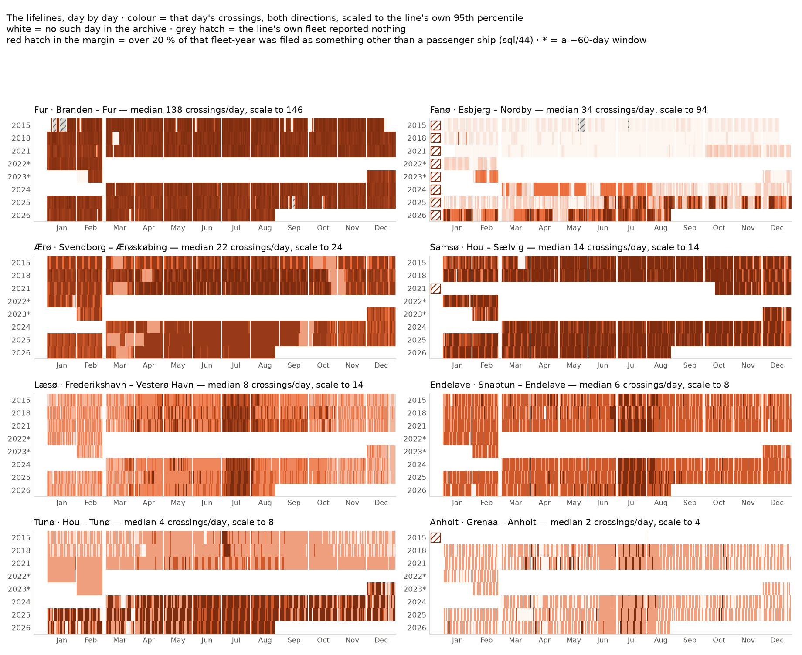
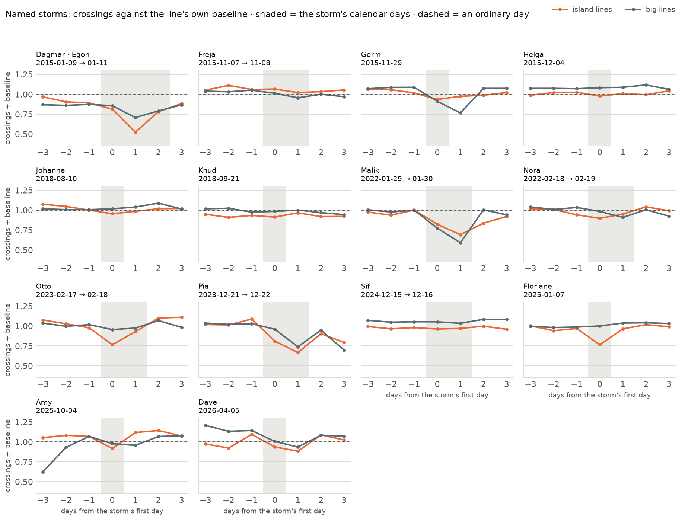
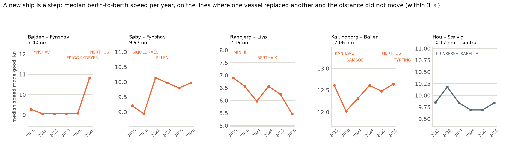

# S8 — chapter 03: the lifelines

The same store as chapters 01 and 02, plus the first tables this project
derives from it. `sql/40_ferry_trips.sql` builds `ferry_stay`,
`ferry_crossing`, `ferry_day` and `ferry_line` out of the 438 M one-minute
positions in `public_track` — every Class A **passenger** vessel in the
archive, 2015 → 2026-08-26. **5 664 659 crossings**, 2 122 local days, **185
ferry lines**, of which **35 are Danish small-island lifelines** (`kind =
'island'`, minus the four big lines this chapter contrasts them with).

**What a crossing is, in two sentences.** A *stay* is any maximal run of
positions of one vessel with sog < 0.5 kn, and a *crossing* is the move between
two consecutive stays of the same vessel whose berth centroids are more than
100 m apart, inside one gap-free session (a position gap over 60 minutes starts
a new one). A crossing is assigned to a ferry line when each of its two berths
is within 1 500 m of a *different* nearest endpoint of the same OSM route —
geometry, not tags — and `data/context/ferry_lines.csv` folds the 348 OSM
objects into the 190 lines a reader would name. All of it is documented, with
the number that justifies each guard, in the header of `sql/40_ferry_trips.sql`.

**Five kinds, and one of them is not a service.** `island`, `domestic`,
`international`, `foreign` and **`harbour`** — five OSM objects that are
intra-harbour legs between two berths of one port (Öckerö, Kalvsund ×2, Ystad,
Frederikshavn). They are real ship movements and they are not sailings;
`sql/41`, `42` and `44` emit them like any other line and **this chapter
excludes all five from every pool, table and chart**, which is why the printed
output names them. `Københavns havnebus` is a service and is in the panel as
`domestic`, but sql/40's termini rule costs it 29 % of its crossings — a
multi-stop harbour network whose OSM relations carry only the two extreme ends —
so it is quoted nowhere here.

**High-speed craft are not here, and neither is a large part of the ordinary
fleet.** `public_track` holds a vessel only on the days its *resolved ship
type* was `Passenger`; an `HSC` or `Undefined` day is not in it at all.
`sql/44_hidden_fleet.sql` measures the hole and finding 23 is about it. It is a
load-time fact — fixing it means re-aggregating 2.3 TB, not editing a query.

**Expected trips come from the data, not from a timetable.** Danish operator
timetables are not archived per year and this archive spans eleven of them; a
hand-made expected-departures table would be invented data, which `CLAUDE.md`
forbids. `sql/41`'s `baseline` is the **median** of what the same line ran on
comparable days — same line, calendar year, season (May–Sep against Oct–Apr)
and **day of the week** — counting only days the line's fleet was **heard**,
with `quantileExactLow` so no ordinary day falls below it by construction. The
day-of-week key is what stops a line that never sails on a Wednesday from
reading as a line that cancels every Wednesday. The one exception is `data/context/ferry_timetable.csv`, eleven
rows read by hand off the operators' 2026 pages with a source URL and a date on
each. It is an **anchor**, not the baseline.

Every number below comes from a query file in `sql/` run through `scripts/ch.sh`.
The three charts and every printed figure are one command:

```bash
uv run --project notes notes/plot_ch03.py
```

| file | what it answers |
|---|---|
| `sql/40_ferry_trips.sql` | **builds** `ferry_stay`, `ferry_crossing`, `ferry_day`, `ferry_line` |
| `sql/41_ferry_daily.sql` | crossings per line-day, the day-of-week baseline, the storm flag, four coverage columns |
| `sql/42_ferry_speed.sql` | per line-year: speed, duration, distance, the modal vessel, `max_kn` |
| `sql/43_ferry_oracle.sql` | the external oracle — July 2025 on one line, from raw positions |
| `sql/44_hidden_fleet.sql` | the fleet `public_track` cannot see, per line-year, per year, per vessel |
| `data/context/ferry_timetable.csv` | the committed timetable anchor, 11 routes, read 2026-09-09 |

**The years.** 2015, 2018, 2021, 2024 (from 03-01), 2025 and 2026 (to 08-26)
are loaded whole or nearly whole; **2022 and 2023 are winter windows of 59 days
each**, sampled for this chapter's storms. They are excluded from every
per-year comparison and used only where a storm falls inside them — Malik and
Nora in 2022, Otto and Pia in 2023 — and are marked `*` on the charts.

**Privacy.** `ferry_crossing` and `ferry_day` carry MMSI for de-duplication and
never leave `data/ch`; `sql/41`–`44` emit none, and `notes/plot_ch03.py`
asserts that its own stdout holds no nine-digit integer. Ferries are public and
are named here.

---

## 1. Does the machinery count real sailings — and what is it missing?

**Finding 23 — between an eighth and a sixth of the ferry fleet is invisible in
any given year, because the archive filed it as something other than a
passenger ship.** `sql/44_hidden_fleet.sql`. A vessel reaches `public_track`
only on days `sql/03_aggregate.sql` resolved its ship type to `Passenger`.
Over the union of every matched line's fleet:

| year | fleet | visible vessel-days | hidden | share | vessels with a hidden day |
|---|---|---|---|---|---|
| 2015 | 412 | 69 433 | 10 406 | **13.0 %** | 274 |
| 2018 | 447 | 74 657 | 10 564 | **12.4 %** | 298 |
| 2021 | 437 | 73 615 | 12 018 | **14.0 %** | 292 |
| 2024 | 494 | 67 371 | 12 946 | **16.1 %** | 352 |
| 2025 | 487 | 76 756 | 14 711 | **16.1 %** | 358 |
| 2026 | 491 | 54 530 | 8 595 | **13.6 %** | 331 |

It is not spread evenly, and where it concentrates it removes a whole ship:
**M/F FENJA and MENJA, two of the three ferries on Esbjerg – Nordby, are filed
`Undefined` for 361–365 days of every year in the archive** and never appear at
all; the Fanø line's hidden share runs **0.67 / 0.66 / 0.59 / 0.67 / 0.49 /
0.33** across the six loaded years. **ANHOLT is `HSC` for all 365 days of
2015**, which is why chart 1's Anholt panel has an empty 2015 row. **PRINSESSE
ISABELLA is `Undefined` for 284 days of 2021**, which is why Samsø's Hou –
Sælvig row stops in March 2021 and resumes in October. **KATTEGAT is `Cargo`
for all of 2018** on Agersø and Omø, and KANALEN is `Cargo` on Thyborøn – Agger
in five of the six years. Every line-year with a hidden day is therefore a
**lower bound**, and chart 1 marks the ones above 20 % in its left margin.

**Finding 24 — with that said, where the fleet IS visible the count is exact:
the observed crossings and the published timetable agree on six of the eight
lines that publish one.** `sql/41` against `data/context/ferry_timetable.csv`.
Observed = median crossings a day over the July 2026 weekdays the fleet was
heard on; expected = 2 × the operator's departures per direction.

| line | timetable × 2 | July 2025 | July 2026 | 2026 ÷ tt |
|---|---|---|---|---|
| Svendborg – Ærøskøbing | 22 | 22 | **22** | **1.00** |
| Frederikshavn – Vesterø Havn (Læsø) | 12 | 12 | **12** | **1.00** |
| Grenaa – Anholt | 2 | 2 | **2** | **1.00** |
| Hou – Tunø | 8 | 8 | **8** | **1.00** |
| Hou – Sælvig (Samsø) | 14 | 14 | **14** | **1.00** |
| Snaptun – Endelave | 8 | 8 | **8** | **1.00** |
| Branden – Fur | 144 | 136 | **137** | **0.95** |
| Ystad – Rønne | 16 | – | **–** | – |
| Esbjerg – Nordby (Fanø) | *none published* | 84 | 82 | — |
| Hals – Egense | *none published* | 127 | 120 | — |
| Helsingør – Helsingborg | *none published* | 150 | 154 | — |

Six exact matches on lines running between 2 and 14 crossings a day is not a
fit: nothing in `sql/40` knows a timetable exists. The **baselines** agree too,
and they are the number every ratio in § 3 and § 4 divides by, one per day of
the week — Svendborg – Ærøskøbing's May–Sep baseline is **22 on all seven days**
in both 2025 and 2026, and Fur's Monday-to-Friday baselines are 137 138 136 138
138 (2025) and 138 137 138 140 136 (2026), **median 138, 95.8 % of the
timetable's 144**. **Fur reads 95 %** because the operator
publishes a frequency rule rather than a departure list (every 15 minutes
05:00–19:00, every 30 to 01:00, hourly after) and the file's own note says the
night sailings run only if someone is waiting; 5 % of 144 is seven sailings.
**Ystad – Rønne has no July weekday on which its own fleet was heard at all** —
its high-season service is fast ferries, which are not in `public_track`, and
what conventional tonnage it has belongs to another line's fleet. The three
lines with no published number are Molslinjen brands whose timetables render
client-side; their own machine-readable catalog returns HTTP 500 for every
route (URLs in the CSV).

**Finding 25 — the oracle and the tables agree on all 31 days, at 22 crossings
and 2 vessels a day.** `sql/43_ferry_oracle.sql` recounts Svendborg –
Ærøskøbing in July 2025 straight from `public_track` and two hard-coded H3
cells — no stays, no sessions, no route matcher, no table `sql/40` writes — and
emits its count beside `ferry_crossing`'s for the same local day. **Max |gap| =
0 over 31 days.** The vessel counts matter as much as the gap: a design-review
finder deleted the oracle's 24-hour bound and 07-04, 07-09 and 07-15 read 23
crossings from **three** vessels — sail-training ships lying in Svendborg and
turning up in Ærøskøbing days later — while `|gap| ≤ 1` stayed green on all
three. `notes/plot_ch03.py` now asserts the vessel count and the level (22) as
well as the gap. The file also recomputes its two cell ids from the coordinates
in its own header every run, so a ClickHouse that flips `geoToH3`'s argument
order shows up as two changed integers rather than as a plausible chart.

---

## 2. The lifelines



*`sql/41_ferry_daily.sql` and `sql/44_hidden_fleet.sql`. Eight island lines, one
row per loaded year, one column per calendar day (twelve blocks of 31, so the
months line up across years of different length). Colour is that day's
crossings in both directions, scaled to that line's own 95th percentile — the
Fur ferry's 138 and Anholt's 2 each fill their own scale. White is a day the
archive does not hold; grey hatch is a day on which the line's own fleet
reported **nothing**, drawn as absence and never as a zero. **The red hatch in
the left margin marks a line-year in which more than 20 % of the fleet's
reporting days were filed as something other than a passenger ship** — Fanø in
all eight rows, Samsø in 2021, Anholt in 2015. `*` marks the two 59-day winter
windows.*

**Finding 26 — the winter timetable is a different timetable on some islands
and the same one on others, and the split is not by size.** `sql/41`. Median
crossings a day, July weekdays against January weekdays, six loaded years
pooled: **24 of the 35 island lines run ≥ 10 crossings a day in July and 19 do
in January; 13 run ≥ 20 in July and 9 in January.** The lines that barely notice
the season are the ones a commute depends on — Fur 140 → 138 (1.01×), Svendborg
– Ærøskøbing 22 → 22, Holbæk – Orø 24 → 24, Hou – Sælvig 14 → 14, Kragenæs –
Femø 14 → 14. The seasonal ones are the excursion lines: **Gudhjem –
Christiansø 10 → 2 (5.0×)**, Aalborg – Egholm 64 → 30 (2.1×), Hou – Tunø,
Kalundborg – Ballen and Havnsø – Nekselø all 2.0×. Fanø's 34 → 16 is not a
finding: two of its three ferries are invisible (finding 23).

**Finding 27 — the thinnest lifeline in the country is one round trip a day,
four or five days a week.** `sql/41`, `sql/42`. Grenaa – Anholt reads a median
of **2 crossings a day** — one round trip, 26.8 nm, 180 minutes each way — in
July and in January alike, and its day-of-week baselines say what the median
hides: **2 2 0 2 2 0 0 in the 2025 winter and 2 2 0 2 2 0 2 in the 2025
summer** — Monday, Tuesday, Thursday, Friday and a summer Sunday, and **never a
Wednesday**, except in the summers of 2018 and 2026, when the line ran all
seven days. Two lines are thinner and neither is a lifeline in the same sense:
**Frederikshavn – Hirsholmene sails three days a week and has no winter at
all** (median 6 crossings a day in July, **0 in January**, and 742 of its 1 686
loaded line-days are days it lay still on a day of the week whose baseline is
zero — the timetable, not a stoppage), and Kragenæs – Askø runs 6 a day in
summer.

**Finding 28 — most Danish island ferries do not know it is Sunday.** `sql/41`,
Sunday median ÷ weekday median over the six loaded years: **ten of the 35
island lines are at exactly 1.00** — Fur, Læsø, Anholt, Tunø, Femø, Livø,
Endelave, Kalundborg – Ballen, Søby – Fynshav and Skarø/Drejø — and Havnsø –
Sejerø runs **more** on Sunday (1.20). The ones that do cut back cut hard:
**Søby – Faaborg 0.60**, Faaborg – Bjørnø 0.47, Rudkøbing – Strynø 0.56,
Aalborg – Egholm 0.69. Svendborg – Ærøskøbing loses one round trip (22 → 20,
0.91). The pattern is not size and it is not island population; it is whether
the line is a road (Fur's ferry replaces a bridge) or a service.

---

## 3. Silence, stillness and cancellation

`sql/41` emits four coverage columns beside every line-day — `fleet_positions`,
`fleet_sog_known`, `fleet_moving`, `fleet_vessels_reporting`, all over the
line's **own-majority** fleet (a vessel-year belongs to the one line it worked
most). They give a day with no crossing a four-word vocabulary, and this
chapter cannot be read without it:

| a day with no crossing | test | island line-days, six loaded years |
|---|---|---|
| **silent** | `fleet_positions = 0` | 2 910 |
| **cannot tell** | heard, but no usable speed all day | 1 |
| **lay still** | heard, under way nowhere | 3 728 |
| **moved, nothing matched** | under way, no crossing on this line | 1 644 |
| (sailed) | | 55 312 |

63 595 island line-days in the six loaded years. Of the 3 728 lay-still days,
**1 175 fall on a day of the week the line normally sails** (baseline > 0) and
2 553 on one it does not. Only the first number is a cancellation count, and it
is the day-of-week baseline that makes it one: under the old weekday-pooled key
it read 1 408, of which 237 were Anholt's Wednesdays and 167 Hirsholmene's
four days off.

**Finding 29 — a Danish island ferry loses a whole day it should have sailed
about two times in a hundred, and the two best-run lines in the archive have
never lost one.** `sql/41`. Lay-still days on a day of the week the line
normally sails, as a share of island line-days: **1.1 % (2015), 1.7 % (2018),
1.9 % (2021), 1.9 % (2024), 1.8 % (2025), 2.8 % (2026)** — no trend, with the
two winter windows at 2.9 % and 3.6 %. Per line: **Svendborg – Ærøskøbing 0 of
2 004 loaded days and Kragenæs – Fejø 0 of 2 004**, Frederikshavn – Vesterø
Havn (Læsø) **exactly one — 2025-01-07, which is storm Floriane**, Hou – Sælvig
0 of 1 720, Kalundborg – Ballen 1, Kleppen – Venø 1, Branden – Fur 16 of 1 991
(0.8 %). At the other end the highest numbers are not the weather either: Fanø
8.8 % is the days its one visible ferry rested while its two invisible ones
worked, Havnsø – Nekselø 6.7 % and Aalborg – Egholm 6.3 % are the two lines
that genuinely stop most often, and Grenaa – Anholt is down from 14.6 % to
**5.9 %** now that its Wednesdays are ordinary days.

**Finding 30 — most runs of consecutive still days are a ship out of service,
and there are 359 of them.** `sql/41`. **359 runs of ≥ 3 consecutive lay-still
days, 2 033 line-days in all** (counting every lay-still day, whatever its
baseline); the longest are Søby – Faaborg 32 days (2021-01-20 → 02-20), Aalborg
– Egholm 29, Søby – Fynshav 27, Frederikshavn – Hirsholmene 22, Ystad – Rønne
21, Marstal – Rudkøbing 21. A run like that, with
the fleet reporting from the berth throughout, is a docking or a refit, and it
is why the storm analysis below uses a ±3-day window rather than a yearly rate.

**Finding 31 — the ten days the Fur ferry lay still in February 2023 were not
ten days without a ferry: the second one was in the archive, filed as
`Undefined`.** `sql/41` reads **Branden – Fur, 2023-02-03 → 02-12: ten
consecutive days, 1 436–1 440 positions a day, zero of them above 1 knot** —
the busiest ferry line in Denmark, motionless. The chapter's first draft
concluded that Fur's second ferry "is not in the archive that year". It is:
`sql/44`'s per-vessel block says **SLEIPNER FUR spent 28 days of 2023 filed as
`Undefined`**, out of a 59-day loaded window, and `sql/42` shows the line with
`vessels = 1` in 2023 against 2–5 in every other year. One ferry lay still, and
the other was filed as something other than a passenger ship for those weeks, so
whether Fur had a ferry on those ten days is a question the archive holds the
answer to but cannot show.
This is the single clearest case in the chapter of a fleet gap that reads as an
outage, and it is why finding 23 comes first.

**Finding 32 — the coverage columns settle the case they were rebuilt for, and
they settle it the other way from the first draft.** `sql/41`. Hals – Egense,
the line whose July 2025 looked like a three-day cancellation:

| day | crossings | baseline | positions | sog known | moving | reads |
|---|---|---|---|---|---|---|
| 2025-07-01 (Tue) | 126 | 116 | 1 069 | 1 069 | 475 | sailed |
| 2025-07-02 (Wed) | 8 | 120 | 625 | 625 | 86 | sailed |
| **2025-07-03 (Thu)** | **0** | 116 | **653** | 653 | **0** | **lay still** |
| **2025-07-04 (Fri)** | **0** | 120 | **651** | 651 | **0** | **lay still** |
| 2025-07-05 (Sat) | 63 | 104 | 1 427 | 1 427 | 216 | sailed |
| 2025-07-06 (Sun) | 114 | 103 | 2 112 | 2 112 | 390 | sailed |

The ferry was heard 653 times on 3 July and not once above one knot. It did not
sail, and the receiver was not the problem. The earlier reading — a receiver
gap inferred from a low message count — was wrong for a structural reason worth
keeping: a Class A transponder reports every 2–10 seconds under way and about
every 3 minutes at rest, so a message *count* falls when a ferry stops sailing.
`ferry_day`'s three columns separate the two; a count never could.

---

## 4. Storms



*`sql/41_ferry_daily.sql` + `data/context/storms.csv`. Every named Danish storm
with a loaded calendar day — 15 storms in **14 panels**, Dagmar and Egon sharing
one because their windows touch. Crossings ÷ the line-day baseline, pooled
inside each group (Σ crossings ÷ Σ baseline), from three days before the storm's
first day to three after; the shaded band is the storm's own calendar days.
Orange = the 35 island lines pooled, grey = the four big lines (Helsingør –
Helsingborg, Rødby – Puttgarden, Køge – Rønne, Gedser – Rostock). A line-day
whose fleet was not heard is excluded, not counted as zero: **369 line-days
across all 14 panels**. Alfrida is absent — its window is 2019-01-01/02 and 2019
is not a loaded year.*

**Finding 33 — five of the fifteen storms cost the small lines more than a
fifth of a day's sailings, and the five are all winter storms.** `sql/41`.
Island lines pooled, the storm's deepest day against the ordinary days in the
same ±3 window: **Dagmar · Egon −42.6 % (0.52 on 2015-01-10), Pia −30.8 %
(0.67), Otto −27.7 % (0.77), Malik −26.0 % (0.69), Floriane −22.0 % (0.76)**;
then Amy −15.9 % and Nora −10.4 %; and the remaining seven under 9 % — Gorm
−8.4 %, **Johanne −6.8 % (August, and nothing happened)**, Dave −6.1 %, Freja
−3.8 %, Helga −3.6 %, Knud −2.2 %, Sif −1.7 %. A DMI class-w1 storm on the list
is not automatically a day a ferry stays in. The unweighted mean of the per-line ratios
is printed beside every pooled figure and agrees within a few points on every
storm that dips, so these are group effects and not one strait dragging the
pool.

**Finding 34 — the small lines stop first on four of the five deepest storms,
and the pooled ratio hides which line actually stopped.** `sql/41`. Island pool
against big pool on the deepest day: Dagmar · Egon **0.52 / 0.71**, Pia **0.67 /
0.74**, Otto **0.77 / 0.95**, and most starkly **Floriane, 2025-01-07: the
island lines drop to 0.76 and the big lines do not move at all (1.00)** — a
storm the small ferries sat out while the Øresund and Fehmarn lines sailed
through. The exception is **Malik, where the big four fall to 0.59 against the
islands' 0.69**. But a pool of four ships is an average of four different
answers: on Dagmar/Egon the big pool reads 0.86 on the first storm day while the
*mean of its four lines* reads 0.55, because **Gedser – Rostock ran 0.33 → 0.22
→ 0.38 of its baseline across 9–11 January 2015** and Helsingør – Helsingborg —
four kilometres of Øresund, twenty minutes — never went below 0.75. The detail
cuts the other way on the small lines: **Svendborg – Ærøskøbing, which has not
lost a whole day in 2 004 loaded ones, ran at 0.44 and 0.39 of its baseline on
Malik's two storm days** while holding 1.00 through all three days of Dagmar and
Egon.

---

## 5. The ships



*`sql/42_ferry_speed.sql`. Median speed made good — berth centroid to berth
centroid over elapsed time — per line and year, on the four Danish lines where
one vessel replaced another between two loaded years at a modal share ≥ 0.8
while the median distance moved by under 3 %. The fifth panel is the control:
PRINSESSE ISABELLA has run Hou – Sælvig alone in all six loaded years. Vessel
names ride along the top at the year the name first appears.*

**Finding 35 — the battery ferry ELLEN made its line 13 % faster, and the newest
hybrid on Bøjden – Fynshav made its line 19 % faster.** `sql/42`. Søby – Fynshav
is one ship, all six years, 9.97 nm that never moves: **SKJOLDNAES 8.94 kn and
67 minutes in 2018 → ELLEN 10.14 kn and 59 minutes in 2021**, +13.4 %, and the
vessel's own reported speed under way moves with it (10.50 → 12.10 kn), which is
what separates a faster ship from a shorter turnaround. Ellen holds 9.80–10.14 kn
through 2024, 2025 and 2026. The bigger step is **Bøjden – Fynshav, FRIGG
SYDFYEN 9.08 kn / 49 min in 2025 → NERTHUS 10.83 kn / 41 min in 2026**
(+19.3 %, sog 10.80 → 13.90, distance 7.41 → 7.40 nm). NERTHUS is traceable
across the archive: it ran Kalundborg – Ballen in 2025 and appears on Bøjden –
Fynshav in 2026, where TYRFING took over the Samsø line. The other two
replacements go the other way — **MINI II → BERTHA K on Rønbjerg – Livø,
−9.0 %**, and KANHAVE → SAMSOE on Kalundborg – Ballen, −4.7 %.

**Finding 36 — a step is not proof, because an unchanged ship drifts as much as
a replacement.** `sql/42`. BERTHA K, alone on Rønbjerg – Livø since 2021, reads
**5.97 → 6.56 → 6.25 → 5.47 kn** across 2021, 2024, 2025 and 2026 — a −17 %
slide on one ship over two years, larger than the replacement that put it there,
and its reported sog slides with it (6.90 → 6.20). TUNOEFAERGEN/TUNOFAERGEN, one
ship under two spellings, loses 6.8 % (7.60 → 7.08 kn, 55 → 59 minutes) with no
vessel change at all. The control, PRINSESSE ISABELLA on Hou – Sælvig, varies
over **9.69–10.18 kn, a 5 % band, with no replacement anywhere in it.** So the
readable threshold on this metric is about 10 %, and only when `med_sog_kn`,
`med_min` and `p90_min` move together and `med_nm` does not. Ellen (+13.4 %) and
NERTHUS (+19.3 %) clear it; Kalundborg – Ballen's −4.7 % does not, and this note
does not claim SAMSOE was slower than KANHAVE.

**Finding 37 — the fleet's speeds made good span eleven-fold, and berth-to-berth
speed is not the ship's speed.** `sql/42`, 2025. Fastest: **Hirtshals –
Kristiansand 21.08 kn** (SUPERSPEED 1, 71.64 nm, 204 min), then Køge – Rønne
16.33 (HAMMERSHUS), Frederikshavn – Göteborg 13.38, Gedser – Rostock 12.57,
Kalundborg – Ballen 12.48. Slowest: **Kleppen – Venø 1.92 kn** (0.12 nm, 4
minutes), Udbyhøj kabelfærge 1.94, Kulhuse – Sølager 2.30, Københavns havnebus
2.64, Aalborg – Egholm 2.71. The gap between speed made good and the vessel's
own median reported speed is where the manoeuvring goes: Hirtshals keeps
**90 %** of its log speed berth-to-berth (21.08 of 23.50), Grenaa – Anholt 93 %,
while Kleppen – Venø keeps 67 % (1.92 of 2.85) and Aalborg – Egholm 55 % (2.71
of 4.90). It is not a clean law — Fur, the shortest crossing of all at 0.23 nm,
keeps 88 %, and Kulhuse – Sølager keeps 90 % over 0.42 nm — so the note states
the examples and not a rule.

---

## Claim → query

| claim | where it comes from |
|---|---|
| 5 664 659 crossings, 2 122 local days, 185 lines, 35 island lines | `sql/40_ferry_trips.sql` (build summary), `sql/41_ferry_daily.sql` |
| hidden share 12.4–16.1 % a year; FENJA/MENJA/ANHOLT/PRINSESSE ISABELLA/KATTEGAT | `sql/44_hidden_fleet.sql`, blocks 2 and 3 |
| Fanø hidden share 0.33–0.67; Samsø 0.43 in 2021; Anholt 0.37 in 2015 | `sql/44_hidden_fleet.sql`, block 1 |
| six timetable lines match exactly; Fur 0.95; Ystad – Rønne unheard | `sql/41_ferry_daily.sql` × `data/context/ferry_timetable.csv` |
| baselines by day of week: Ærø 22 on all seven, Fur Mon–Fri median 138, Anholt 2 2 0 2 2 0 0 | `sql/41_ferry_daily.sql`, read off the rows |
| oracle 22 = table 22 and 2 = 2 vessels on all 31 days, max \|gap\| 0 | `sql/43_ferry_oracle.sql` |
| July ÷ January medians; 24 vs 19 lines ≥ 10 crossings/day | `sql/41_ferry_daily.sql` |
| Anholt 2 crossings/day, Wednesday baseline 0; Hirsholmene 3 days a week | `sql/41_ferry_daily.sql`, `sql/42_ferry_speed.sql` |
| ten island lines at Sunday ÷ weekday = 1.00; Faaborg – Bjørnø 0.47 | `sql/41_ferry_daily.sql` |
| 2 910 silent / 1 cannot tell / 3 728 lay still (1 175 due) / 1 644 moved, of 63 595 | `sql/41_ferry_daily.sql`, the four coverage columns |
| Ærøskøbing and Fejø 0 lost days of 2 004; Læsø's one is storm Floriane | `sql/41_ferry_daily.sql` |
| 359 runs of ≥ 3 lay-still days, 2 033 line-days | `sql/41_ferry_daily.sql` |
| Fur 2023-02-03 → 02-12: 1 440 positions/day, 0 moving; SLEIPNER FUR 28 hidden days | `sql/41_ferry_daily.sql`, `sql/44_hidden_fleet.sql` block 3 |
| Hals – Egense 2025-07-03: 653 positions, 0 moving | `sql/41_ferry_daily.sql` |
| storm depths −42.6 % (Dagmar · Egon) … −1.7 % (Sif) | `sql/41_ferry_daily.sql` × `data/context/storms.csv` |
| Gedser – Rostock 0.22 on 2015-01-10; Ærø 0.39 on Malik | `sql/41_ferry_daily.sql` |
| ELLEN +13.4 %, NERTHUS +19.3 %, BERTHA K −9.0 %, control band 5 % | `sql/42_ferry_speed.sql` |
| 21.08 kn down to 1.92 kn; made-good ÷ sog 90 % … 55 % | `sql/42_ferry_speed.sql` |
| unmatched 8.98 %, of which 5.72 % over 1 km; 90.8 % carry a line; residual 150 crossings | `sql/41_ferry_daily.sql`, second block |

---

## Caveats, and the things that are not findings

**The hidden fleet is the first caveat and it applies to every number above.**
`sql/44`. A line-year with `hidden_days > 0` is a lower bound, and 12–16 % of
the fleet's vessel-days are hidden in any year. Two consequences the chapter has
already had to absorb: Fanø's counts are a lower bound in **every** year, not
"trustworthy from 2024" as the first draft claimed — the ferries that are
missing were always missing; and the Fur ten-day gap (finding 31) is a hidden
ship, not an absent one. The measurement has a known bias of its own, stated in
`sql/44`'s header: the fleet of a line is every MMSI that ever made a matched
crossing on it, held fixed across all years, so a vessel that genuinely joined
in 2024 counts as hidden in 2015 — early hidden days are an over-estimate in
exactly the way early crossings are an under-estimate. Read `fleet_vessels`
beside `hidden_vessels` before quoting a share.

**The baseline is keyed on the day of the week, and that was not free.** An
earlier version of this chapter pooled Monday to Friday, as `daytype` does, and
reported Grenaa – Anholt as cancelling 14.6 % of its days — 237 Wednesdays it
never sails — and Frederikshavn – Hirsholmene 9.9 %. `sql/41` now keys the
baseline on (line, year, season, **day of week**) and those days are ordinary:
Anholt reads 5.9 %, Hirsholmene 4.2 %, and the island total falls from 1 408
line-days to **1 175**. The price is smaller groups — roughly 13 days in an
Oct–Apr group and 22 in a May–Sep one — so a thin line's baseline is now a
median over a dozen days and a single day should not be read without
`fleet_vessels_reporting` beside it.

**8.98 % of all crossings match no route, and 5.72 % of them are over 1 km.**
`sql/41`'s second block: the unmatched share runs 5.12 % (2023) to 11.41 %
(2015), and **90.8 % of the 5 664 659 crossings carry a line**. The split at
1 km is the honesty number for sql/40's 100 m distance guard — under 1 km is
most likely a move inside one harbour that the nearest-endpoint rule correctly
refused; **over 1 km, 324 177 crossings, is a real passage on something OSM does
not carry as a ferry route**. Nothing here counts them. A further 9 714 matched
a route below the 200-crossing floor and have no line.

**Svendborg – Skarø – Drejø lost three quarters of its crossings to an OSM
coverage gap.** `sql/40`'s header measures it: 13 505 of the now-unmatched
crossings berth at 55.0084 N 10.4745 E, which is **Hjortø**, the island
HØJESTENE calls at between Svendborg and Drejø, and both OSM objects for the
line carry only the two extreme endpoints. Faaborg – Lyø – Avernakø has the same
shape and loses nothing, because OSM carries a way per leg pair. The line's 519
"moved, nothing matched" days — by far the highest of any island line — are the
same gap seen from the other side, and its absolute counts are not comparable
with any other line's.

**The panel is 150 crossings short of the crossings that carry a line, on 52
line-days spread over six named days.** Both blocks of `sql/41` now key the year
on the local date, so the two agree on which year a crossing belongs to; what
remains is the day domain, which is restricted to local days whose UTC date has
a `ferry_day` row. That drops **2016-01-01 (19 crossings), 2019-01-01 (28),
2022-03-01 (13), 2023-03-01 (42), 2024-01-01 (15) and 2026-08-27 (33)** — the
spill-over at the edges of the loaded windows, where a crossing departing at
23:xx UTC on the last loaded day is filed on a local date the loader never
covered. The alternative is worse: those days would read as total silence on the
strength of the loader's calendar. Inside the loaded range the two calendars
still differ, and **2.09 % of crossings depart between 22:00 and 23:59 UTC**, so
their coverage figure is really the previous UTC day's. Do not divide crossings
by the coverage columns.

**The coverage fleet is not always the fleet that sailed.** `sql/41` builds
coverage from own-majority vessels — a vessel-year belongs to the one line it
worked most — which is what stopped a line being credited with its neighbour's
transponder. The price is stated in the file's header and visible here: **1 195
island line-days have crossings and no coverage at all**, because the ship that
sailed them belongs to another line's fleet. Those days are "sailed" in the
table above and are excluded from every ratio in § 4.

**`max_kn` found sql/40's implied-speed guard too loose, and it was lowered
from 40 kn to 30.** `sql/42`'s column exists so the guard has a consumer, and on
the first build it fired: the Danish maximum was **38.15 kn on Hou – Sælvig** —
a 10.17 nm crossing recorded in 16 minutes, the real distance over an elapsed
time truncated by a coverage hole — with 12 Danish line-years above 30 kn.
At 30 kn the archive holds 1 315 fewer crossings (0.023 %) and **no Danish
line-year reaches the guard**: the Danish maximum is now 29.07 kn (Hou – Sælvig
2026), the store-wide maximum 29.65 (Trelleborg – Karlshamn 2025), and 14 of 378
Danish line-years still have a fastest crossing over 20 kn. Those are the same
kind of artefact one step smaller; every figure this chapter quotes is a median,
and none of them moved.

**Four of the 1 281 line-year rows have a speed made good above the vessel's
own median reported speed** — all four thin foreign rows of 1 to 90 crossings.
Two medians over different populations can cross on a handful of samples; the
script bounds both the count and the thinness, because the same thing happening
on a line-year with hundreds of crossings would mean `nm`/`minutes` and
`med_sog` had stopped describing the same crossing.

**`kind = 'harbour'` is excluded everywhere and `Københavns havnebus` is quoted
nowhere.** The five harbour legs are 9 480 line-days of intra-harbour shuffling
that OSM happens to carry as ferry ways; folded into the services whose names
OSM gave them they put ~32 000 sub-1 km moves into Öckerö – Grötö and 690 into a
93 nm Świnoujście – Ystad. The havnebus is a real service, but sql/40's termini
rule — a crossing must match two *different* nearest endpoints of one route —
cannot see a multi-stop network whose relations carry only the two extreme ends,
and it costs the line 29 % of its crossings.

**Negative result: the storm list is not a cancellation list.** Eight of the
fifteen storms move the island lines by under 9 %, one of them (Knud) not at
all, and the one August storm on the list is invisible. What the data supports
is that **the five deepest storms in this archive are all winter storms, and
each cost the small lines a fifth to a half of a day's sailings.**

**Negative result: "a new ship shows up as a speed step" is only true above
about 10 %.** Finding 36. Two of the five year-on-year steps on Danish lines are
smaller than the drift of a ship that was never replaced, and one unchanged ship
(BERTHA K) moved further than any replacement.

**Negative result: a low message count is not a receiver gap.** § 3. The first
version of this chapter read Hals – Egense's quiet days as the receiver failing
and said so; `ferry_day`'s position/speed/movement split says the ferry was
heard 653 times and moved not once. A Class A transponder's message *rate*
depends on whether the ship is moving, so a count can never separate the two.

**Six loaded years are not a time series.** As in chapters 01 and 02: 2015,
2018, 2021, 2024, 2025 and 2026 were chosen for coverage, not sampled. Every
claim above that runs across years prints all six numbers.
