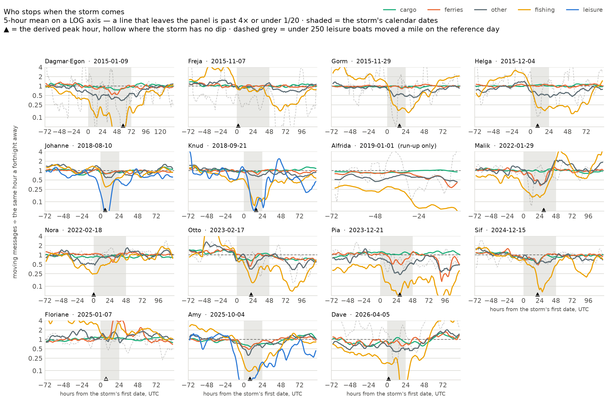
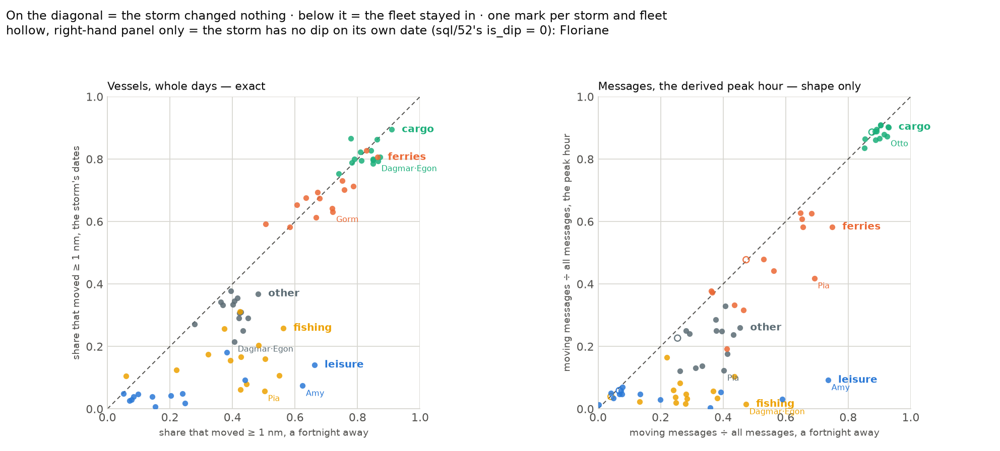
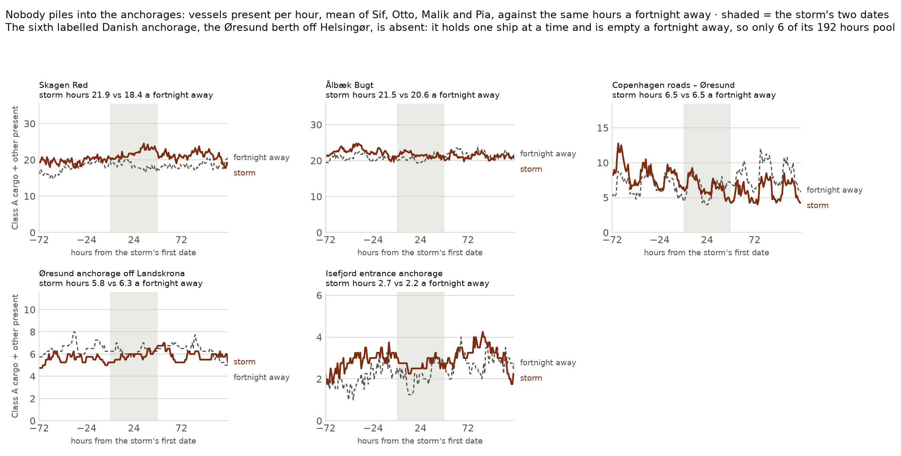

# S9 — chapter 04: when the storm comes

The same store as chapters 01–03, read four new ways. `data/context/storms.csv`
holds the named Danish storms DMI has published since 2013; **15 of them have a
window that touches a loaded day**, with Dagmar and Egon counted as one event
because their windows overlap — exactly as chapter 03 counts them. Around each
one this chapter asks a single question, fleet by fleet: *who stops, when, and
by how much.*

**The three instruments, and why there are three.** `docs/PLAN.md` § S9 asked
for "hourly moving vessels by group". **That number does not exist.**
`h3_hourly.vessels` is a `uniqExact` state over every vessel *present* in a
cell-hour and no state of the moving subset was ever stored — the same
constraint `sql/11`, `12`, `24` and `30` all state. What exists is:

| instrument | grain | exact? | where |
|---|---|---|---|
| vessels **heard** | hour | yes | `sql/50`, `uniqExactMerge(vessels)` |
| moving **messages** ÷ the same fleet a fortnight away | hour | shape only | `sql/50`, `ratio_moving` |
| ferry **departures**, Danish-end lines | hour | yes | `sql/50`, from `ferry_crossing` |
| vessels that **moved ≥ 1 nm** ÷ vessels heard | day | yes | `sql/52`, from `vessel_day` |

The hourly ratio is a *message* ratio. A Class A ship reports every few
seconds, a Class B one every 30 s at best, and the reporting rate itself rises
with speed — so the ratio may be compared to the same fleet's own reference
hour and to nothing else. Every claim about *how many boats* stayed in comes
from the day grain, where the count is exact.

**The reference is the same UTC hour a fortnight away** — 14 days earlier, so
the weekday and the time of day survive and the season barely moves; 14 days
*later* when that day is not loaded (Dagmar · Egon, whose −14 d lands in the
unloaded end of 2014); both, for Otto, whose window straddles the edge of the
2023 February window. **Every emitted hour of all 15 storms has a reference**;
no storm was dropped for want of one.

**The window is built from calendar dates with no timezone conversion**, the
rule chapter 03 established: every row of `storms.csv` carries `date-only`,
because DMI publishes the *date* a storm crossed Denmark. Hour 0 is
`toDate(start_utc)` 00:00 UTC and the window runs from 72 h before it to 72 h
after the storm's last date ends.

Every number below comes from a query file in `sql/` run through `scripts/ch.sh`.
The three charts and every printed figure are one command:

```bash
uv run --project notes notes/plot_ch04.py
```

| file | what it answers |
|---|---|
| `sql/50_storm_window.sql` | per (storm, hour, fleet): heard, moving messages, the reference hour, the ratio, and the departures on the ferry lines with a Danish end |
| `sql/51_anchorage_fill.sql` | the anchorage cells by rule, the labelling guard, and how full each anchorage is hour by hour |
| `sql/52_who_stays.sql` | per (storm, fleet, day): vessels heard and vessels that moved ≥ 1 nm; every fleet on the storm's **derived** peak hour, with `is_dip`; and the fleet that ever runs a ferry crossing, by the ship type it was filed under that day |
| `sql/53_storm_oracle.sql` | two recounts: Pia's fishing collapse by three definitions of "moved", and the Ærø lifeline counted from raw `public_track` positions against what `sql/40` wrote |
| `data/context/anchorages.csv` | the hand labels for the rule's cells — names and source URLs, no numbers |

**Privacy.** `vessel_day` carries MMSI and never leaves `data/ch`; `sql/50`–`53`
emit counts over whole fleets in whole hours, and `notes/plot_ch04.py` asserts
that its own stdout holds no nine-digit integer. No leisure vessel is named,
positioned or tracked anywhere in this chapter. Ferries and commercial vessels
are public and the Ærø line is named.

---

## 1. Who stops



*`sql/50_storm_window.sql` + `sql/52_who_stays.sql`. One panel per storm, in
date order. Each line is one fleet's moving messages divided by the same
fleet's moving messages at the same hour a fortnight away, as a 5-hour mean, on
a **log** axis — a ratio, so half and double should be the same distance from
1.0. The shaded band is the storm's own calendar dates; ▲ on the axis is the
derived peak hour, **hollow where the storm has no dip on its own date**
(`is_dip = 0` — Floriane, and only Floriane). The leisure line is drawn dashed,
grey and out of the legend where the storm's reference days had fewer than
**250** Class B leisure vessels covering a mile: eleven of the fourteen, from
**Nora 15.5** to **Dave 203**. Only **Knud 506, Amy 2 056 and Johanne 2 096**
are a fleet, and only there is the blue line data.*

**Finding 38 — cargo does not stop. Not once, in fifteen storms.**
(`sql/52_who_stays.sql`.) On the exact instrument — vessels that covered at
least a nautical mile, divided by vessels heard, pooled over the storm's own
dates against the same number of days a fortnight away — the Class A cargo
fleet moves by **−0.072 at worst (Dagmar · Egon, 0.793 against 0.865), a median
of −0.015, and +0.088 at best (Johanne)**. The hourly message ratio says the
same: cargo's pooled ratio over the storm dates runs **0.66 (Amy) to 1.12
(Floriane)**, and on the deepest storm in the archive — Pia, 2023-12-21/22 —
the fleet sent **4 683 637 moving messages on the storm's second date against
4 544 874 on the ordinary Wednesday before it**. More, not fewer. A 3 000-tonne
coaster on a schedule is not asking the weather's permission.

**Finding 39 — the fishing fleet stops, and it stops harder than anything else
in the archive.** (`sql/50`, `sql/52`.) Class A fishing's share of vessels that
moved a mile falls by **0.446 under Pia (0.057 against 0.503), 0.443 under
Dagmar · Egon, 0.366 under Amy and 0.363 under Dave**; the median across the 14
storms with observed dates is **−0.270**. In messages the collapse is starker
still, because a boat that does go out goes slower: pooled ratios of **0.101
(Dave), 0.113 (Amy), 0.118 (Dagmar · Egon), 0.135 (Pia)**. On Pia's second
date the whole Danish fishing fleet sent **58 921 moving messages against
461 314 two days earlier — 12.8 %** — while **298 boats were still being heard**
on the same day. They were all there. They were tied up.

**Finding 40 — the order is fishing, then leisure, then the tugs and the
supply boats, then the ferries; cargo never arrives.** (`sql/50`.) Take each
fleet's own pre-window median ratio (offsets −72 .. −25) and ask when its 5-hour
mean first falls below half of it. Across the 14 storms with observed dates:

| fleet | halved on | median hour |
|---|---|---|
| fishing | **14 of 14** storms | **+0 h** |
| leisure | 13 of 14 | +6 h |
| other (tugs, offshore, HSC) | 9 of 14 | +9 h |
| ferries | 6 of 14 | +17 h |
| cargo | **2 of 14** (Otto, Sif) | +19 h |

The fishing fleet's median crossing is *the storm's first midnight* — it is
already halved when the date DMI publishes begins, which is what a fleet that
reads the forecast looks like. The ferries, when they give at all, give
seventeen hours in, which is what a fleet that waits for the actual sea looks
like.

*One row of that table is not independent of another.* The baseline each fleet
is halved against is its own **−72 .. −25 h**, and **Gorm's +48 .. +95 h are
exactly Helga's −72 .. −25 h** — the two storms are five days apart, so the 48
hourly rows are emitted twice under two names and Helga's "calm run-up" is
partly Gorm's recovery. `sql/50`'s header measures both overlaps in the
archive; the other is Nora's, whose reference hours **2022-02-01/02** lie in
**Malik's +72 .. +119 h**, so Nora's fortnight-away baseline is Malik's
aftermath. Neither pair may be pooled and neither is a check on the other.

**Finding 41 — the ferries thin the timetable and keep sailing.**
(`sql/50`'s `ferry_crossings`.) The column counts departures on the lines with
at least one **Danish end** — island, domestic and international. It is not
"the country's ferry service" in the sense of everything in the bbox: `sql/50`
drops **36.5 % of the crossings in these hours as foreign** (Göteborg, the Kiel
canal, Rügen, the Baltic long-haul — a Danish storm is not their weather),
0.66 % as intra-harbour and 7.48 % as unmatched, on the storm side and the
reference side alike.

Departures per storm day against the same hours a fortnight away: **Malik
0.705, Pia 0.718, Amy 0.724, Dagmar · Egon 0.730, Dave 0.813** — and then
**Johanne 0.893, Gorm 0.914, Sif 0.932, Freja 0.961, Helga 0.965, Knud 0.968,
Otto 0.973, Nora 0.989, Floriane 1.145**. Pia, the deepest storm in the
archive, cost the Danish timetable **1 076 departures on 2023-12-21 and 880 on
2023-12-22 — 1 956 over the two dates against 1 363 a day a fortnight
earlier**. On the exact instrument the passenger fleet's share of vessels that
moved a mile barely moves at all: worst **−0.090 (Gorm)**, median **−0.012**,
and *up* on **four** storms — **Floriane +0.086, Dave +0.046, Sif +0.040, Otto
+0.022**. Both are true and they are not in conflict: the same ships sail,
fewer times. Chapter 03 measured the same thing one line at a time and found
the small island lines cancelling a fifth to a half of a day's sailings on five
winter storms (finding 33); this is that, pooled over every line with a Danish
end.

**Finding 42 — `other` is the fleet that behaves like a fishing fleet with a
contract.** (`sql/52`.) Tugs, offshore support, dredgers, guard vessels and —
since S8 — every high-speed craft in the archive sit in `other`. Their share of
vessels that moved a mile falls on **every one of the 14 storms**, worst
**−0.191 (Dagmar · Egon)**, median **−0.090**, best **−0.008 (Floriane)**. They
never collapse the way the fishing fleet does and they never hold the line the
way cargo does; their pooled message ratio runs **0.45 (Pia) to 1.23
(Floriane)**. Part of that group is ferries wearing another hat on the day —
see the hidden-fleet caveat below, which measures how much.

---

## 2. Who was out at all



*`sql/52_who_stays.sql`. One mark per storm and fleet. Left: the exact
instrument — vessels that covered ≥ 1 nm ÷ vessels heard, the storm's dates
against the fortnight-away dates. Right: the message share of moving traffic on
the storm's derived peak hour against the same hour a fortnight away, which is
a weaker quantity and is drawn separately so the two are never read as one
series. On the diagonal = the storm changed nothing. **Hollow marks, in the
right-hand panel only**, are `is_dip = 0`: Floriane's five points, whose "peak
hour" is the least bad hour of a storm with no dip at all on its own date.*

**Finding 43 — the leisure fleet is the one that stops completely, and only
three storms in the archive can say so.** (`sql/52`, `sql/50`.) Class B leisure
is a summer fleet: in mid-winter the whole bbox holds a few hundred
transponders, most of them a boat on a mooring. Over the 68 December-February
days of these windows the number of leisure vessels that actually cover a mile
runs **p25 9.8, median 14, p75 22, and 61 at the very most** — ten to twenty
boats a day, against a median storm hour of **234 (Otto) to 328 (Sif)**
transponders heard. Three storms fall where the fleet is actually at sea —
**Johanne (2018-08-10), Knud (2018-09-21) and Amy (2025-10-04)** — and there the
signal is the largest in the chapter: **Amy 0.074 against 0.624 (−0.550),
Johanne 0.141 against 0.662 (−0.522), Knud 0.092 against 0.440 (−0.348)**, over
**1 110, 1 336 and 760 vessel-days heard**. On Amy's peak hour, **857 leisure
vessels were heard and 9.2 % of their messages were moving ones, against 73.6 %
a fortnight earlier**. That is a fleet that heard the forecast and did not
leave the harbour.

**Finding 44 — in a winter storm the leisure ratio is not a finding, it is a
handful of boats — and the floor that says so is on the day count, not on the
head count.** (`sql/50`, `sql/52`.) The obvious floor is "how many leisure
vessels were *heard* at the reference hour", and it is the wrong instrument:
the recent winter storms hear **234 to 328** of them in a median storm hour and
the line sails straight through, while `sql/52` counts **ten to twenty of those
boats covering a mile in the whole day**. So the floor is read off the
reference day's `moved` instead. Measured, per storm: **Nora 15.5, Helga 17,
Dagmar · Egon 18, Otto 26, Pia 26.5, Floriane 27, Gorm 35, Sif 43.5, Malik 79,
Freja 107, Dave 203** — and then **Knud 506, Amy 2 056, Johanne 2 096**. The
literal sits in that gap, at **250**, and it leaves exactly three storms drawn
as data. Eleven winter ratios that looked like the deepest leisure collapses in
the archive (Dagmar · Egon 0.100, Gorm 0.166, Helga 0.234) are one marina's
afternoon and are now dashed grey and out of the legend. The February storms
are the sharpest case: **Nora's leisure delta is −0.002**, because the fleet's
*reference* share was already 0.051 — there was nothing left to stop.

**Finding 45 — "a storm that shows nothing" depends entirely on which fleet you
are looking at, and chapter 03 was looking at ferries.** (`sql/50`, `sql/52`.)
S8 found Knud (−2.2 %), Sif (−1.7 %) and Johanne (−6.8 %) barely moved the
island lines. Every one of them moved the fishing fleet hard: **Knud −0.280,
Sif −0.261, Johanne −0.112** on share-moved, with pooled message ratios of
**0.230, 0.269 and 0.451**. Johanne, the August storm chapter 03 called
invisible, is the second-deepest leisure event in the whole archive. The
genuinely quiet storm on this instrument is **Nora (2022-02-18)**: fishing
−0.096, leisure −0.002, ferries −0.004, cargo −0.049, and Danish-end departures
at **0.989** of the reference — a one-percent thinning, which is no thinning.
Nora is a named DMI storm on which the sea did what it does every February.

**Finding 46 — Floriane has no dip on its own date, and the "dip" it does have
is the last hour of the window.** (`sql/52` block 2.) The peak hour is
*derived*, because DMI gives dates and no hours: it is the hour of the storm's
own dates at which the pooled Class A moving-message ratio is lowest. For
Floriane that hour is **2025-01-07 07:00 UTC at a ratio of 1.0535 — above 1,
i.e. no dip anywhere in the published date.** `sql/52` says so in a column:
`is_dip = 0`, and Floriane is the only storm in the archive for which it is 0,
which is why its ▲ is hollow in chart 1 and its five marks are hollow in chart
3.

The whole-window minimum is **0.7589, at offset +95 h — the last hour the
window contains** (2025-01-10 23:00 UTC, three days past the published date).
It is an **edge, not a trough**: the two hours before it are 0.7980 and 0.8220,
the curve is still falling when the window stops, and nothing after it was
measured. Whatever it is, it is not this storm.

Restricting the search to the storm's own dates changes the answer for **6 of
the 14 storms that have an own-date hour at all** (Dave, Floriane, Freja,
Helga, Nora, Otto — Alfrida has none, so 14 and not 15) and `sql/52`'s header
records both. This is the price of a date-only storm list, stated rather than
smoothed: a quiet storm must be allowed to read as quiet, and a minimum three
days out is a different weather system.

**Finding 47 — the derived peak hour lands anywhere in the day, which is the
best evidence that the date is the only thing DMI is telling us.** (`sql/52`
block 2.) The fourteen peak hours are 00, 02, 02, 05, 06, 06, 07, 08, 09, 10,
16, 16, 21, 21 UTC — no clustering at any time of day, and **three of the
fourteen fall past the storm's first date**: Malik **+30 h** and Pia **+29 h**
on the second date, and Dagmar · Egon **+58 h**, which on a three-day event
(2015-01-09 .. 11) is **2015-01-11 10:00 UTC — the third**. The deepest are
**Sif 0.4464, Amy 0.4591, Otto 0.5230 and Dagmar · Egon 0.5385**: at those
hours the country's Class A fleet was sending under half the moving messages it
sent a fortnight away.

---

## 3. Where the ships that stopped went — a negative result



*`sql/51_anchorage_fill.sql`. Class A cargo + `other` vessels present per hour
at each Danish anchorage, the mean of the four deepest two-day storms (Sif,
Otto, Malik, Pia), against the same hours a fortnight away. The anchorages come
from a rule — a sea cell, a still share ≥ 0.8, ≥ 50 distinct vessels in the year
— and a hand label with a source URL; a rule cell with ≥ 100 vessels and no
label makes the query throw. **Five panels, not six**: the sixth labelled Danish
anchorage, `Øresund anchorage off Helsingør`, is not drawn at all. It is a berth
that holds one ship at a time and is empty a fortnight away, so only **6 of its
192 hours** have all four storms reporting on both sides — a panel of six dots,
which is a measurement of the berth and not of the storm. It is out of the chart
and out of finding 48's and 49's medians.*

**Finding 48 — nobody piles into the anchorages. The storm hours are not fuller
than the days around them.** (`sql/51`.) Over the **70 storm × anchorage
cells** the chapter can compute — five anchorages × the 14 storms with observed
dates — the median ratio of *the storm's own hours* to *the 72 hours before
them* is **1.02**. Not 1.4, not 1.2 — two percent. Vessels present at Skagen
Red under Sif: 16.6 before, **18.4 during**, 19.5 after. Ålbæk Bugt under
Malik: 22.0, **22.5**, 22.1. The most Copenhagen roads managed was to *empty*
under Otto (6.0 → **2.6**). The intuition this chart was built to show — the
fleet that stops running has to be sitting somewhere, and the roadsteads should
visibly fill — is **not in the data at hourly resolution**.

**Finding 49 — what the anchorages do show is a week, not a storm.**
(`sql/51`.) The median ratio of storm hours to the *fortnight-away* hours is
**1.06**, and the individual elevations are real but wide: **Skagen Red under
Pia holds ~20 vessels an hour through the entire eight-day window (19.9 before,
20.3 during, 19.6 after) against 14.3 a fortnight earlier**; under Otto it is
21.9 / 27.8 / 25.8 against 19.5. The elevation starts three days before the
storm's date and is still there three days after. Whatever it is — a week of
weather, of which DMI named one day; a Christmas-week lull in the cargo
timetable — **it is not resolvable to the storm hours, and this chapter does not
claim it is.** The honest reading of chart 2 is that a two-day named storm does
not move Danish anchorage occupancy by more than the noise of the week it sits
in.

**Finding 50 — Alfrida is a run-up with no storm attached, and it is worth
exactly one paragraph.** (`sql/50`, `sql/52`.) Alfrida crossed on 2019-01-01/02
and **2019 is not loaded**, so the store holds only the three days before it:
2018-12-29/30/31. Over those three days Class A fishing's share of vessels that
moved a mile runs **0.183 → 0.101 → 0.078** against 0.430 / 0.412 / 0.666 a
fortnight earlier, and the pooled message ratio for the run-up is **0.162**.
The temptation is to call that the fleet reading the forecast three days out.
**Do not:** the three days are 29, 30 and **31 December**, the reference days
are ordinary mid-December ones, and no instrument here can separate a storm
run-up from New Year's Eve. It is recorded as a hole in the archive with a
plausible confound, not as a finding about weather.

---

## 4. The checks

**Finding 51 — the two aggregate tables agree to the message, and "moved" means
three different things that all tell the same story.** (`sql/53` block 1.)
Pia's fishing week recounted from `vessel_day`: vessels with *any* moving
message go **99 → 63 → 41** over 12-20/21/22; vessels that covered a mile go
**72 → 24 → 11**; the loosest definition never falls below the strictest
(`moved_gap ≥ 0` on all eight days, running 14 to 39). The same days' moving
messages summed out of `vessel_day` and out of `h3_hourly` — two tables written
by two separate `INSERT`s in `sql/03_aggregate.sql` — differ by **0 on all
eight days**. Whichever definition the essay quotes, the collapse survives.

**Finding 52 — the Ærø lifeline, counted twice by two routes that share
nothing but the day.** (`sql/53` block 2.) The oracle side counts crossings
from **raw `public_track` positions** in two hard-coded res-7 cells — no
`ferry_crossing`, no line label, no route matching, no sessionisation. The
table side is what `sql/40` wrote for `Svendborg – Ærøskøbing`. Over Pia's
eight days both sides read **20, 20, 20, 16, 18, 18, 14, 16** crossings for
12-18 .. 12-25, with a **gap of 0 on every day** and two vessels a day. Pia's
two dates cost the lifeline four and two crossings against an ordinary December
day, on a line that runs 22 a day in summer. Both sides are pinned to those
eight literals in `notes/plot_ch04.py`, so a change that moved them together
cannot pass by keeping the gap at zero.

---

## Claim → query

| claim | where it comes from |
|---|---|
| 15 storms, their windows, and which reference rule fired for each | `sql/50_storm_window.sql` |
| cargo: worst −0.072, median −0.015, best +0.088 on share-moved | `sql/52_who_stays.sql` block 1 |
| Pia: cargo 4 683 637 vs 4 544 874, fishing 58 921 vs 461 314, passenger 736 203 vs 1 112 095 moving messages | `sql/50_storm_window.sql`, summed over the hours of each date |
| fishing worst −0.446 (Pia); median −0.270; pooled ratios 0.101–0.135 | `sql/50`, `sql/52` block 1 |
| the halving table: fishing 14/14 at +0 h … cargo 2/14 at +19 h | `sql/50_storm_window.sql`, each fleet against its own pre-window median |
| Gorm's +48..+95 h are Helga's −72..−25 h; Nora's reference hours are inside Malik's window | `sql/50_storm_window.sql`'s header, measured over all 24 storms |
| ferry departures 0.705 (Malik) … 1.145 (Floriane) of the reference; Pia 1 076 + 880 = 1 956 | `sql/50_storm_window.sql`, `ferry_crossings`, Danish-end lines only |
| the ferry fleet filed outside `passenger`: Pia 19.4 % on 12-22 against 21.6 % on 12-08 | `sql/52_who_stays.sql` block 3 |
| leisure Amy −0.550, Johanne −0.522, Knud −0.348; 857 heard at Amy's peak hour | `sql/52` blocks 1 and 2 |
| the leisure floor: Nora 15.5 … Dave 203, then Knud 506, Amy 2 056, Johanne 2 096 | `sql/52_who_stays.sql` block 1, `ref_moved` on the storm's own dates |
| winter leisure that moves: p25 9.8, median 14, p75 22, max 61 vessels a day | `sql/52_who_stays.sql` block 1, December–February days of these windows |
| Knud/Sif/Johanne quiet for ferries, deep for fishing; Nora quiet for everyone | `sql/50`, `sql/52`, against `notes/ch03-findings.md` finding 33 |
| Floriane's own-date peak ratio 1.0535 and `is_dip` 0; the window minimum 0.7589 at +95 h, the last hour in it | `sql/52_who_stays.sql` block 2, `sql/50` pooled over Class A |
| the fourteen peak hours; deepest Sif 0.4464, Amy 0.4591, Otto 0.5230 | `sql/52_who_stays.sql` block 2 |
| anchorages: median storm ÷ pre-window 1.02, storm ÷ fortnight 1.06, over 70 cells | `sql/51_anchorage_fill.sql` block 3, the five charted anchorages |
| Skagen Red under Pia 19.9 / 20.3 / 19.6 against 14.3; under Otto 21.9 / 27.8 / 25.8 | `sql/51_anchorage_fill.sql` block 3 |
| Alfrida's three run-up days: 0.183 → 0.101 → 0.078, pooled ratio 0.162 | `sql/50`, `sql/52` block 1 |
| Pia's fishing week 99 → 63 → 41 and 72 → 24 → 11; `msgs_gap` 0 on all 8 days | `sql/53_storm_oracle.sql` block 1 |
| Ærø 20/20/20/16/18/18/14/16 on BOTH sides, gap 0, 2 vessels a day | `sql/53_storm_oracle.sql` block 2 |

---

## Caveats, and the things that are not findings

**The hourly ratios are message ratios, not vessel counts.** `ratio_moving` is
one fleet's moving AIS messages divided by the same fleet's moving messages an
hour a fortnight away. Reporting rates differ by class and rise with speed, so
a fleet that halves its ratio has not necessarily halved its boats — it may have
halved its speed. The direction is trustworthy, the magnitude is not, and the
level may never be compared across fleets. Every magnitude this chapter states
as a *fleet* number comes from the day grain instead.

**Distinct moving vessels per hour are not recoverable.** `h3_hourly.vessels` is
a `uniqExact` state over everything present in the cell-hour. There is no state
of the moving subset and there never was; producing one means re-aggregating
2.3 TB. This is why the plan's "hourly moving vessels by group" became three
instruments instead of one, and why the exact answer to "how many stayed in" is
a **day**.

**High-speed craft are absent, and the passenger fleet is 12–18 % invisible.**
Both are load-time facts inherited from S8: `HSC` resolves to `other` at load
time (475 vessels, 785 M messages), and a ferry is in `public_track` only on
days its resolved ship type was `Passenger`, which hides 12–18 % of the matched
fleet's vessel-days a year. The ferry-departure column of `sql/50` inherits
that hole exactly.

**And the hole MOVES between a storm day and its reference day.** `sql/52`
block 3 measures it directly: take every Class A vessel that has ever run a
crossing, and count it by whatever ship type `vessel_day` resolved for it *that
day*. On **Pia's second date, 2023-12-22, 19.4 % of that fleet was filed
outside `passenger`** (37 of 191 vessels) — against **21.6 % on its reference
day, 2023-12-08** (53 of 245). Across the 14 storms the share runs 13.0 % to
27.4 % and it is not the same on the two sides of any comparison. Two numbers
in this chapter carry that directly: **`sql/52`'s `share_moved` for
`passenger`** is a share of a fleet whose membership changed between the days
being compared, and **finding 42's `other` group** is where the ferries that
left `passenger` went. Neither is wrong by a factor; both are noisier than
their decimals suggest, and a difference smaller than a couple of points — the
passenger fleet's median −0.012, say — is inside this effect.

**Winter leisure is about fifteen moving boats.** Over the 68
December–February days of these windows the Class B fleet that covers a mile in
a day has quartiles **9.8 / 14 / 22** and a maximum of **61**, out of 234 to
328 transponders heard in a median storm hour. Three storms — Johanne, Knud,
Amy — fall in a season where the fleet is real (506 to 2 096 boats moving on
the reference day); everywhere else the leisure line is drawn for completeness,
dashed grey and out of the legend. `heard` is not "boats out": a transponder on
a moored boat reports all winter, and that is exactly why the floor is on the
day count and not on the head count.

**The reference is one fortnight, not a seasonal baseline.** A single day 14
days away keeps the weekday and the hour and costs about two weeks of season —
which matters most exactly where the leisure signal lives. Johanne's reference
is 2018-07-27, the height of the season, against a storm on 2018-08-10; Amy's
is 2025-09-20 against 2025-10-04, the shoulder. Both make the storm look worse
for ferries than the storm's own pre-window does (**Johanne 0.63 against the
reference, 0.71 against the three days before; Amy 0.58 against 0.67**), and
both figures are printed side by side for every storm. On the Danish-end ferry
column that cuts both ways: **Johanne is 0.893 against the reference and 0.931
against its own three days before**, so the fortnight makes it look worse,
while **Amy is 0.724 against the reference and 0.708 against its pre-window**,
so there it makes it look better. A proper baseline is a distribution over
comparable days, which is chapter 03's `baseline` and is what S12 should use
for anything published.

**Two storm windows in the archive are not independent of each other.**
`sql/50`'s header measures both. **Gorm (2015-11-29) and Helga (2015-12-04)
share 48 hours**: Gorm's +48 .. +95 h are exactly Helga's −72 .. −25 h, so the
same hourly rows are emitted twice under two names, Helga's pre-window baseline
*is* Gorm's aftermath, and any figure that pools storms pools those hours
twice. **Nora's reference hours 2022-02-01/02 lie inside Malik's +72 .. +119
h**, so Nora's "quiet fortnight away" is Malik's recovery for the run-up half
of its panel. Nothing double-counts inside a single storm's panel; the pairs
matter to finding 40's halving table, which is normalised against exactly those
pre-window hours, and to finding 45's reading of Nora as the quiet storm.

**DMI's dates are editorial.** `storms.csv` says `date-only` on every row: the
storm's start and end are days, and the 00:00:00 / 23:59:59 stamps are that day
written as a timestamp, not a measured hour. Everything in this chapter that
looks like an hour — the window, the peak, the "stops first" table — is
*relative to a calendar date somebody chose*. Finding 46 is what that costs.

**Negative result: the anchorages do not fill.** Finding 48. The chapter was
planned around "vessels stationary in known anchorage cells by hour in the
window" and the hourly answer is 1.02× the days on either side. The chart says
so and the note says so; it is not hidden behind an eye-catching week-scale
elevation that this instrument cannot attribute to the storm.

**Negative result: cargo is not a control that failed, it is the answer.**
Finding 38. Cargo was included as the fleet that ought to move least — big
ships, schedules, deep water — and it is the one fleet in the archive on which
fifteen named storms leave no trace at all.

**Two of the fifteen storms are not storm profiles.** Alfrida has only its
run-up (finding 50) and Dagmar · Egon is two DMI storms merged into one
three-day event — the only three-date window in the chapter, which is why its
derived peak at +58 h lands on a third date no other storm has. Malik, Nora,
Otto and Pia sit inside the **59-day winter windows** of 2022 and 2023, so
their references are inside the same window by construction and nothing about
their years may be inferred from them.
