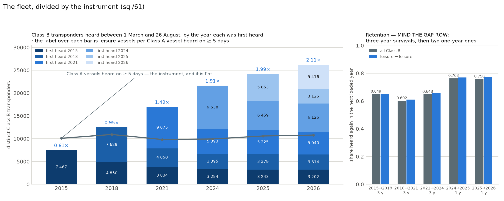
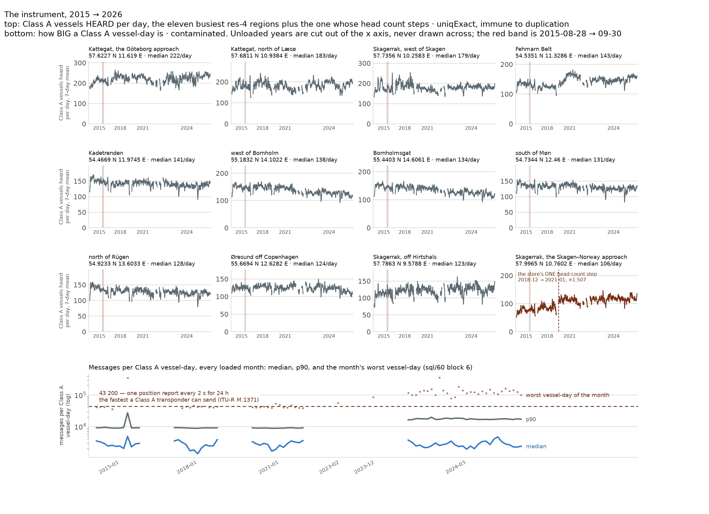
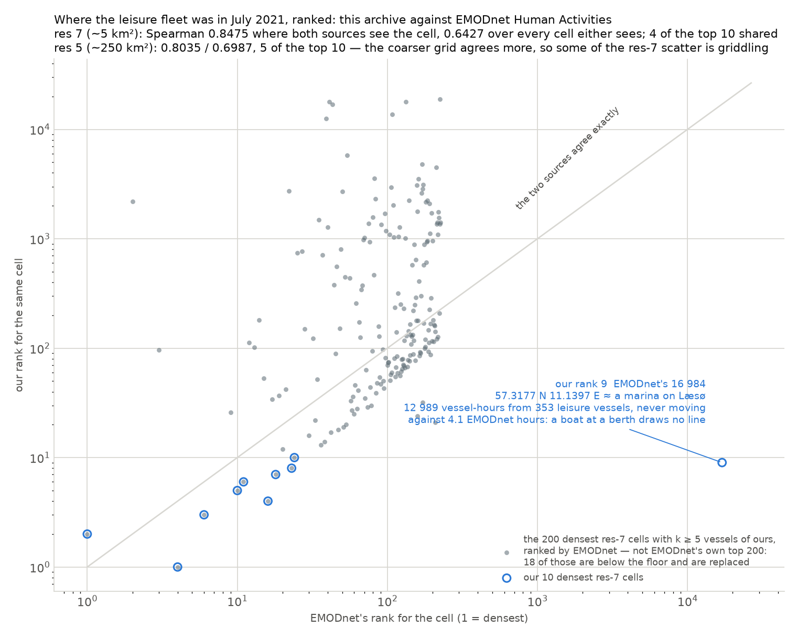

# S10 — the honesty layer: how much of the change is the instrument

Chapters 01–04 measured the sea. This one measures the *archive*: which of the
eleven-year changes are boats, and which are the network that hears them, the
transponders that report, and the pipeline that stores what they said.

Three query files, each read exactly once, and three charts:

```bash
uv run --project notes notes/plot_honesty.py
```

| file | what it answers |
|---|---|
| `sql/60_coverage_index.sql` | Class A vessels and messages per day per res-4 sea region; the store-wide daily reference with `load_log` joined correctly; the Sep-2015 inflation factor; every region-month whose level moved; the winter night shares with two controls; and **block 6**, the distribution of messages per Class A vessel-day per loaded month against the physical ceiling |
| `sql/61_adoption.sql` | Class B distinct transponders per year on the common window, the first-seen cohort, retention between loaded years, and Class B message counts per vessel-day and per vessel-hour |
| `sql/62_emodnet_compare.sql` | our July-2021 leisure density against EMODnet Human Activities, cell by cell, by rank; and **block 5**, the EMODnet hours we have no vessel-hour for, split into four zones of the bbox |

---

## The paragraph the essay opens with

> Between 1 March and 26 August — the window common to all six reference years
> — Class B transponders filed as leisure in Danish waters go from **6 137 in
> 2015 to 22 773 in 2026, ×3.711**. Divided by the fleet sharing the same
> receivers, Class A ships heard on five days or more, it is **×3.469**: the
> instrument costs **6.5 %** of the rise. So much for what this archive
> supports; now what it does not. Message counts are contaminated twice:
> 2015-08-28 → 09-30 is duplicated **×2.199**, and between 2022-03 and 2023-11
> the Class A message *tail* doubles permanently while the median stands still —
> **0.1796–1.0921 %** of vessel-days land above the **43 200** messages a
> transponder can physically send, against **0–0.0612 %** before. Head counts and
> distances are immune. Reach barely moved: of 139 sea regions exactly
> **one** busy one moves its head count by more than a third, the Skagen–Norway
> approach, **×1.507**. Of the rows read, **4.025–11.338 %** are dropped as
> non-vessel and **0–6.278 %** as outside the box — and the box is not Denmark:
> **98.9 %** of the leisure hours EMODnet sees in the Danish core are in water
> we see too; west of lon 7 — the Wadden and the North Sea corner — **61 %** are
> not. Ferries are **12–18 %** invisible, high-speed craft absent. 2016, 2017,
> 2019 and 2020 are unloaded: the storms Alfrida and Rolf never happened here.
> Leisure's winter night share rose **43 %** against 2015 and **90 %** against
> 2018; cargo's, on the same nights,
> **3.9 %**.

---

## 1. What the fleet is made of



*`sql/61_adoption.sql` blocks 1, 2 and 3. Left: every Class B transponder heard
between 1 March and 26 August, stacked by the year it was **first** heard in
that window — a first *loaded* year, never a build year, because 2016, 2017,
2019 and 2020 are not in the store. The grey line is the instrument: Class A
vessels heard on ≥ 5 days of the same window. The label over each bar is
leisure vessels per one of those. Right: the share of a year's Class B fleet
heard again in the **next loaded year** — read the gap row, three of the five
bars are three-year survivals.*

**Finding 53 — the adoption curve, written down, and the denominator that
breaks.** (`sql/61` block 1.) On the common window the fleet goes **7 467 →
12 479 → 16 959 → 21 610 → 24 159 → 26 223** Class B transponders, of which
**6 137 → 10 426 → 14 615 → 19 006 → 21 024 → 22 773** were ever filed as
leisure. The full-year numbers are larger and not comparable across the six
(2024 starts 2024-03-01, 2026 ends 2026-08-26), which is why the window exists.
The **denominator** is the trap: distinct Class A vessels in a whole year reads
**25 421 (2015), 27 909 (2018), 17 870 (2021), 17 512 (2024)** — a commercial
fleet that apparently shrank by a third and did not. What is measured is this:
transponders heard on exactly one day of the year number **8 428 (2015) and
9 527 (2018)** against **3 195 (2021) and 2 822 (2024)**, and **7 617** of
2015's 8 428 sent three messages or fewer all year (median: one). The likely
reading — a reading, not a finding — is that a one-day, one-message MMSI is a
garbled AIS frame decoded into a plausible number rather than a ship; the
archive keeps no checksum, no receiver and no raw sentence, so nothing here can
confirm it, and nothing in the chapter needs it to be true. The count is enough
to disqualify the denominator. Class A heard on ≥ 5 days is stable — **13 056 /
13 909 / 12 540 / 12 527 / 13 748 / 11 696** — and is the only denominator a
ratio may use. Class B has the same one-day tail, milder and *growing with the
fleet* rather than faster: 687 → 2 679 one-day transponders, 9.2 % → 10.2 % of
the window's fleet, so the headline is not a tail artefact.

**Finding 54 — the rise survives being divided by the instrument, to within
6.5 %.** (`sql/61` block 1.) Leisure Class B per Class A vessel heard on ≥ 5
days: **0.6087 (2015), 0.9548 (2018), 1.4881 (2021), 1.9128 (2024), 1.9853
(2025), 2.1117 (2026)** — **×3.469** over eleven years, against **×3.711** on
the raw count. The instrument itself moves **×1.070** over the same window.
Denmark now hears **two leisure boats for every commercial ship** in this box,
where in 2015 it heard three commercial ships for every five leisure boats.
This is the single most important number in the chapter: if the whole rise had
been receivers, this ratio would be flat, because a new receiver hears both
fleets.

**Finding 55 — a fifth of each year's fleet is new and an eighth is eleven
years old.** (`sql/61` block 2.) 2026's 26 223 transponders break down by first
loaded year as **3 202 (2015) / 3 314 (2018) / 5 040 (2021) / 6 126 (2024) /
3 125 (2025) / 5 416 (2026)**: **20.7 % first heard this year, 12.2 % carried
all the way from 2015**. The curve is accumulation, not churn — but "first seen
in 2018" means *not heard in 2015 and heard in 2018*, and a boat that arrived
in 2016 is in the 2018 cohort. The unloaded years are inside every cohort
label.

**Finding 56 — retention is high and rose, and three of the five numbers are a
different statistic.** (`sql/61` block 3.) Share of a year's Class B heard again
in the next loaded year: **0.6495 (2015→2018), 0.6016 (2018→2021), 0.6484
(2021→2024)** — all *three-year* survivals — then **0.7632 (2024→2025) and
0.7584 (2025→2026)** over one year. Leisure-to-leisure is the same or slightly
higher (**0.6489 / 0.6097 / 0.6580 / 0.7694 / 0.7732**). Counting *any* later
year instead of the next one lifts the three-year figures to **0.7481 / 0.7266
/ 0.7588**: about a tenth of the fleet skips a reference year and comes back.
A transponder is not a boat — an MMSI changes hands when a boat is sold — so
this is transponder survival, not fleet survival.

**Finding 57 — the fleet in the box is more German than Danish, and its
messages are not comparable across 2023.** (`sql/61` block 4.) Of the distinct
Class B transponders in the common window, the German MIDs 211/218 hold
**0.3226 / 0.3155 / 0.3370 / 0.3605 / 0.3520 / 0.3532** and the Danish 219/220
**0.1807 / 0.1936 / 0.2542 / 0.2608 / 0.2491 / 0.2441** — Germany is the larger
group in every loaded year. The bbox (lat 53–59, lon 3–17) reaches Kiel,
Flensburg, Rügen and the Dutch Wadden, so "the Danish leisure fleet" is
shorthand for *the leisure fleet in this box*. On the message-count side — and
it is a duplication story, not a fleet reporting more often — messages per
Class B vessel-hour go **41.1 / 39.5 / 37.1** and then **50.5 / 50.1 /
49.6** — **+36 %** across the same gap in which finding 59 finds duplication —
while the median messages per vessel-**day** does not move that way (**548 /
438 / 388 / 471 / 469 / 433**). Median distance covered on a day a boat moved
falls slowly, **18.09 → 14.79 nm**, as the fleet fills with smaller trips.

---

## 2. What the instrument did



*`sql/60_coverage_index.sql` blocks 1, 4 and 6. Top three rows: Class A vessels
**heard** per day (a `uniqExact` head count, immune to duplicated messages) as
a 7-day mean, in the eleven busiest res-4 regions plus the one region whose head
count steps. The x axis is an index over **loaded** days — the unloaded years
are cut out and no line is drawn across them. The pink band is 2015-08-28 →
09-30. Bottom: how **big** a Class A vessel-day is, every loaded month, on a
log axis — median, p90, and the month's worst single vessel-day against the
43 200 a Class A transponder can physically send in a day. Place names are read
off the cell centre by hand; they are not a data field.*

**Finding 58 — the Sep-2015 duplication is real, store-wide, ×2.199–2.552 on
Class A, and S10 masks it with a flag rather than rewriting it.** (`sql/60`
block 3.) Over 2015-08-28 → 09-30, the median Class A vessel-day holds **4 684
messages against 1 948 in the 30 days before and 2 312 in the 30 days after —
×2.199**; on the median over days of that day's mean it is **9 950 against
3 644 / 4 153 — ×2.552**. Class B is inflated less (**×1.468 / ×1.784**) and
that comparison is confounded by season, so read the Class A figure as the
size of the event. **`vessels` and `dist_nm` are structurally immune**:
`uniqExact` counts a vessel once however many copies of its message arrive, and
`sql/03_aggregate.sql` only counts a distance step when `ts - pts BETWEEN 1 AND
3600`, so a duplicate carrying the same second contributes no distance at all.
Nothing is deleted or rescaled: `sql/60` blocks 1 and 2 carry a `dup_window`
column, block 4 a `dup_month`, and `sql/24_night.sql` excludes the window
outright.

**Finding 59 — there is a second contamination, larger and permanent, and it
was not in the plan: the Class A message tail doubles somewhere between 2022-03
and 2023-11 while the median does not move.** (`sql/60` block 6, written for
this session.) Messages per Class A vessel-day, by loaded month: the **median**
runs **1 374–3 828 across the 36 clean pre-2023 months and 1 911–4 694 from
2023-12 on** — no trend (July reads 2 394 / 1 374 / 1 869 in 2015 /
2018 / 2021 and 2 160 / 2 384 / 2 223 in 2024 / 2025 / 2026), while the **p90**
sits at **8 749–9 428 in 37 of the 38 months of 2015, 2018, 2021 and
2022-01/02**, reaches **11 877 in 2023-02**, and lands at **16 261–19 607 in
every month from 2023-12 on**. p99 goes **14 156–16 980 → 20 314 →
31 633–44 041**. **A tail step, not a level step.** What settles what kind of
change it is, is the ceiling: ITU-R M.1371 caps a Class A transponder at one
position report every 2 s, i.e. **43 200 a day**, so a vessel-day above that
did not happen — the archive holds the same message more than once.
`share_over_cap` runs **0–0.0612 %** in the clean pre-2023 months and
**0.1796–1.0921 %** from 2023-12 on, and the same test finds the Sep-2015
window unaided (**0.3538 % of vessel-days in 2015-08, 2.1832 % in 2015-09**), which is what
validates it. The worst vessel-day of 2024-11 is **359 899 messages, 8.33× the
ceiling**. It is **not** the archive's monthly→daily file switch: that is
2024-03, and the monthly 2023-12 zip is already stepped. **Consequence: any
message count compared across 2023 compares two instruments**, exactly as
across 2015-09; head counts and `dist_nm` are immune for the reasons in finding
58. Class B steps too and by less (`sql/60` block 6b: p90 messages per Class B
vessel-day **1 306 (2015) / 1 069 (2018) / 979 (2021)** against **1 527 (2024) /
1 500 (2025) / 1 505 (2026)**, while its median falls from 642 to 453). That is
`sql/61` block 4's +36 % seen from the other side.

*Sporadic duplication predates 2023, and the note says so rather than drawing a
clean line: **13 of the 36 clean pre-2023 months already hold at least one
vessel-day above the ceiling**, nine of them above 79 000 messages, the worst
being **106 122 in 2018-01**. What 2023 changes is the rate, by roughly a
factor of ten.*

**Finding 60 — no region steps on the head count except one, while the message
count per vessel steps twice — and what moves there is duplication, not a fleet
reporting more often.** (`sql/60` blocks 1 and 4.) 139 res-4
regions (~1 770 km² each, `sql/60`'s header) pass the "median ≥ 20 Class A vessels a day in at
least one loaded year" floor, giving 284 399 region-days. Of the 2 572 flagged
region-months, **135 sit in a region of ≥ 80 vessels a day, and exactly one of
those flags on the head count**: **57.9965 N 10.7602 E ≈ the Skagerrak, the
Skagen–Norway approach**, median daily Class A vessels **75 → 113, ×1.507**,
between **2018-12 and 2021-01** — a **25-month** comparison with two unloaded
years inside it, so nothing here can say when in between it happened. Every
other large-region flag is a *message-rate* flag, and they cluster exactly
where findings 58 and 59 say they should: **2015-10 (31), 2015-09 (30), 2023-12
(14), 2024-10 (8), 2024-09 (6), 2023-02 (5), 2021-01 (5)**. Below ~80 vessels a day a step is counting noise, which is why the head-count
claim is made only for the big regions; `sql/60`'s header point 3 measures the
flag rate by region size.

*"No step" is not "no change", and the step table cannot see the difference.* A
ratio between one month and the previous one is blind to a slope that takes
eleven years, and the twelve charted regions have slopes: over the eleven the
table does not flag, the 2015 → 2026 yearly medians of the daily Class A head
count run **×0.82 to ×1.16** — west of Bornholm **148 → 121**, Bornholmsgat
**146 → 120**, north of Rügen **137 → 121** (about −18 %) against the Fehmarn
Belt **134 → 156** and the Göteborg approach **205 → 236** (about +16 %). The
twelfth is the Skagen–Norway approach at **×1.57**, which *is* the flagged step.
A drift is traffic and reception together and this store cannot separate them;
what it can say is that no unflagged drift leaves ±20 % in eleven years.

**Finding 61 — the pipeline drops 4–11 % of every file, and the day-keying of
`sql/13` (removed in S10) hid it.** (`sql/60` block 2.) `load_log` records four
counters that partition every file's `rows_read` exactly, and `sql/60`'s header
reports zero violations of that invariant over every loaded file. Expressed as shares of
rows read: **non-vessel 4.025–7.807 %** on a monthly file and
**5.519–11.338 %** on a daily one, **out-of-bbox 0.004–2.154 %** and
**0.000–6.278 %**, **sentinel positions 0.281–0.728 %** and **0.044–0.982 %**.
The catch is that `sql/13_coverage_daily.sql`, S4's coverage query, joined
`load_log` on `toDate(ts_min)`, which is right for a daily file and wrong for a
monthly one — it filed a whole month's drop counts under the 1st and left the
other 27–30 days null. It had no consumer left, so S10 removes it rather than
fixing the same query twice; `sql/60` block 2 expands each row into the days its
range covers instead: `load_log`'s rows become **2 122 day rows, all distinct**, and every
loaded day carries a share. On a monthly file the four shares are the **file's** figures
repeated on every day it covers, and the `grain` column says which kind of file
a day came from — **1 213 days from monthly zips, 909 from daily ones**.

**Finding 62 — the winter night-share rise survives two controls, and the
residual is not necessarily the network.** (`sql/60` blocks 5 and 5b.) Over
October–April, on the same local days and the same clock, the leisure Class B
share of moving messages sent between 22:00 and 05:00 runs **0.0547 (2015),
0.0413 (2018), 0.0769 (2021), 0.0815 (2024), 0.0784 (2025)** — **+43 % against
2015 and +90 % against 2018**, taking 2025 as the last complete Oct–Apr. The
ferry control moves **0.2041 → 0.2002** and the harder cargo control — a fleet
that runs all night by nature, so its night share is almost purely a property
of the network — moves **0.3006 → 0.3107, +3.4 %**, and +3.9 % by 2026. `sql/60`
block 5b then measures the residual: Class A cargo messages per vessel-hour,
night ÷ day, go **1.0240 / 1.0168 / 1.0211** (2015 / 2018 / 2021) and
**1.0826 / 1.0926 / 1.1076** (2024 / 2025 / 2026). **That ~8 % is not established as a
reception change.** Block 5b's `vessel_hours` is a head count and therefore
immune to duplication, and cargo's night ÷ day vessel-hours are **0.4193 /
0.4218 / 0.4201 / 0.4092 / 0.4103 / 0.4231 / 0.4203 / 0.4216** across all eight
loaded years — flat, and flat against 7/17 = 0.4118, the clock's own share. The
network hears the same fraction of the cargo fleet at night in 2026 as in 2015;
only the *message* ratio moved, and it moved exactly across finding 59's step.
**What can be concluded:** the leisure night share rose an order of magnitude
more than any control, and no night *reach* change is measurable at all.
**What cannot:** that the ~8 % message residual is the network rather than
night-heavy duplication — this store cannot separate them.

---

## 3. Somebody else's numbers



*`sql/62_emodnet_compare.sql` blocks 1, 3, 4 and 5. One dot per res-7 cell
(~5 km²) among the **200 densest cells that clear our k ≥ 5 floor**, ranked by
EMODnet for July 2021 — not EMODnet's own top 200: **18** of those hold fewer
than five distinct leisure vessels of ours, drop out, and are replaced by cells
ranked as far down as 225. Our own ten densest are drawn over them, floored the
same way. Both axes are **ranks**, log
scale — the two sources measure different quantities (EMODnet sums the time a
line between two positions spends in a 1 km pixel; we count presence in a
cell-hour), so only the order can be compared.*

**Finding 63 — an independent source agrees about where the fleet is, and
disagrees about our box and about marinas.** (`sql/62` block 3.) Over the
**51 798** res-7 cells either source puts anything in, the Spearman rank
correlation is **0.8475 where both sources see the cell**, **0.6427 over the
union**, and Pearson on `log1p` is **0.691**. **4 of EMODnet's ten densest
cells are in our ten**, 10 of 25 — and the pair blocks are the 200 densest
*among the cells that clear k ≥ 5*, not EMODnet's own top 200, of which **18**
(res 7) and **23** (res 5) fall below the floor and are replaced. At res 5
(~250 km², bigger than the difference between the two griddings) the union
figure rises to **0.6987** and
the top-10 overlap to 5, so *some* of the res-7 disagreement is grid and most of
it is not. Two specific disagreements matter. **The unit mismatch**: our 9th
densest cell, **57.3177 N 11.1397 E ≈ a marina on Læsø** (a place name read off
the coordinate), holds **12 989 vessel-hours from 353 leisure vessels** and
EMODnet gives it **4.1 hours, its rank 16 984** — a boat at a berth draws no
line, so EMODnet's method cannot see a full marina and ours cannot distinguish
one from a busy channel. **The bbox edge**: **10.26 % of EMODnet's leisure hours
fall in cells where we have nothing**, against **0.62 %** the other way. That
asymmetry is our scope, not our reception — `sql/62` **block 5** splits it by
where the res-7 cell centre is, four zones tested in order so they partition the
bbox: **61.19 % of EMODnet's leisure hours west of lon 7** (the Wadden and the
North Sea corner above it) are in cells we have no vessel-hour in, **32.96 %
east of lon 13.5** (the Swedish east coast, Västervik and Norrköping),
**7.13 % south of 54.5 N** (the German Bight and Baltic coast) and **1.12 % in
the Danish core** (lon 7–13.5, lat ≥ 54.5). The bbox reaches water the Danish
receiver network does not. *Until S10's design review that split was four
numbers in a query header — 3.0 / 13.3 / 33 / 53 — that no query in the repo
produced; two of the four do not reproduce under any zone rule, and block 5
replaces them.*

---

## Claim → query

| claim | where it comes from |
|---|---|
| 6 137 → 22 773 leisure transponders, ×3.711, on the common window | `sql/61_adoption.sql` block 1, `window = 'mar_aug'` |
| ×3.469 per Class A vessel heard on ≥ 5 days; the instrument itself ×1.070 | `sql/61_adoption.sql` block 1 |
| ghost MMSIs: 8 428 / 9 527 one-day Class A vessels against 3 195 / 2 822 | `sql/61_adoption.sql` block 1, `full_year` |
| cohorts 3 202 / 3 314 / 5 040 / 6 126 / 3 125 / 5 416 for 2026 | `sql/61_adoption.sql` block 2 |
| retention 0.6495 / 0.6016 / 0.6484 over three years, 0.7632 / 0.7584 over one | `sql/61_adoption.sql` block 3 |
| German 0.3155–0.3605 against Danish 0.1807–0.2608 of the Class B fleet | `sql/61_adoption.sql` block 4, MID = `intDiv(mmsi, 1000000)` |
| Sep-2015 ×2.199 on the vessel-day median, ×2.552 on the daily mean | `sql/60_coverage_index.sql` block 3 |
| the 2023 tail: p90 8 749–9 428 → 11 877 → 16 261–19 607; share over 43 200 0–0.0612 % → 0.1796–1.0921 % | `sql/60_coverage_index.sql` block 6 |
| Class B's tail: p90 979–1 306 → 1 500–1 527 | `sql/60_coverage_index.sql` block 6b |
| one large-region head-count step, ×1.507, 2018-12 → 2021-01, 57.9965 N 10.7602 E | `sql/60_coverage_index.sql` block 4 |
| dropped shares 4.025–11.338 % non-vessel, 0–6.278 % out of bbox | `sql/60_coverage_index.sql` block 2, `load_log` by day range |
| night shares 0.0547 → 0.0784 leisure against 0.3006 → 0.3107 cargo | `sql/60_coverage_index.sql` block 5 |
| cargo night ÷ day: messages 1.0211 → 1.1076, vessel-hours flat at 0.4092–0.4231 | `sql/60_coverage_index.sql` block 5b |
| Spearman 0.8475 / 0.6427 at res 7, top-10 overlap 4; 10.26 % vs 0.62 %; 18 / 23 of EMODnet's top 200 floored out | `sql/62_emodnet_compare.sql` block 3 |
| the missed hours by zone: 61.19 / 32.96 / 7.13 / 1.12 % | `sql/62_emodnet_compare.sql` block 5 |
| the twelve regions' 2015 → 2026 drift, ×0.82 .. ×1.16 (×1.57 for the flagged one) | `sql/60_coverage_index.sql` block 1, yearly medians |
| the Læsø marina cell: our rank 9, EMODnet's 16 984 | `sql/62_emodnet_compare.sql` block 4 |

---

## Caveats, and what is a proxy

**A "vessel" is a transponder, everywhere in this chapter.** An MMSI is
reassigned when a boat is sold and re-registered, and a new transponder in an
old boat is a new MMSI. Findings 55 and 56 measure transponder lifetimes.

**And this is adoption of AIS, not ownership of boats.** Class B was optional in
2015 and is still not mandatory for Danish pleasure craft. A boat that exists
and is silent is in no table. This is the single largest reason the ×3.711 is not
a count of new boats, and no number in this store can bound it.

**A receiver's identity is not in the data at all.** The archive is a merged
national feed; no row says which base station heard it. Finding 60's step is
*evidence that the network changed there*, never a receiver list, and `sql/60`
names no station and locates none. Neither can anything here measure **reach**:
a vessel heard by nobody is in no table, so "how well did it hear what it heard"
is the only question available.

**`msgs_per_vessel` and every "per vessel-hour" figure is a MEAN, and a mean
over a doubling tail is not a reporting rate.** This is finding 59's practical
consequence and it reaches three columns: `sql/60` block 2's
`class_a_msgs_per_vessel_day`, `sql/60` block 5b's cargo messages per
vessel-hour (246 → 442 across 2023), and `sql/61` block 4's Class B messages per
vessel-hour (37.1 → 50.5). All three rise by roughly half across the step;
none of them shows a transponder reporting faster.

**The unloaded years are inside every three-year number.** 2016, 2017, 2019,
2020 and ten months of 2022 and 2023 are not in the store. A cohort is a *first
loaded year*; a retention is a *three-year* survival for the first three pairs
and a one-year one for the last two; finding 60's step is a 25-month gap. Two
named storms, **Alfrida (2019-01-01/02) and Rolf (2024-02-23)**, fall entirely
in unloaded stretches and are absent from chapter 04 — Alfrida keeps only its
three run-up days.

**The bbox is not Denmark.** lat 53–59, lon 3–17 reaches Kiel, Flensburg, Rügen,
the Swedish west coast and the Dutch Wadden. German-flagged Class B outnumbers
Danish in every loaded year (finding 57), and `sql/62` block 5 measures 61 % of
the EMODnet leisure hours west of lon 7 as water we never see. Say "the leisure
fleet in this box", not "the Danish leisure fleet", wherever the difference
could matter.

**12–18 % of the ferry fleet is invisible and high-speed craft are absent.**
Both are load-time facts inherited from S8 and not recomputed here: `HSC`
resolves to `ship_group = 'other'` at load time (475 vessels, 785 M messages),
and a ferry is in `public_track` only on days its resolved ship type was
`Passenger`, which hides 12–18 % of the matched fleet's vessel-days a year —
`sql/44_hidden_fleet.sql` and `docs/DECISIONS.md`, 2026-09-10. A fix is a
2.3 TB reload.

**EMODnet is a cross-check on shape, never a second opinion on a level.** It is
built from the same underlying AIS by a different pipeline, a different receiver
mix and a different definition (codes 04 Sailing + 05 Pleasure Craft against our
`ship_group = 'leisure'`), and its unit is *hours of line inside a 1 km pixel*
against our *presence in a 5 km² cell-hour*. No ratio between the two levels is
quoted anywhere in `sql/62` or here. Only the rank travels.

**Class A vessels heard on ≥ 5 days is a proxy for "the receiver network", and
an imperfect one.** It is stable (finding 53) and it shares the receivers with
the leisure fleet, which is exactly what finding 54 needs. It is not a
measurement of receivers: a commercial fleet can also grow, and the ×1.070 over
eleven years is small enough that this does not change the conclusion — but it
is an assumption, and it is the one the ×3.469 rests on.

**The peak-day figures in `docs/STATUS.md`'s S4 section are pre-redo.** Present
leisure vessels on July's peak day were recorded there as 2 055 / 3 598 / … ;
on the current store `sql/10_season_daily.sql` gives **1 936 / 3 464 / 4 950 /
6 771 / 7 255 / 7 527**. The current store is the truth; the older figures came
from the store that was rebuilt in S4-redo. *Those six numbers and the ferry
figures above are the only ones in this note that `notes/plot_honesty.py` does
not print — they belong to `sql/10_season_daily.sql` and to S8's
`sql/44_hidden_fleet.sql`, and are cited rather than recomputed.*

**Negative result: the receivers did not arrive.** The chapter was planned
around "receivers added → step changes here". Over eleven years and 139 sea
regions there is one such step, in one corner of the Skagerrak. What did change,
twice, is how many copies of a message the archive keeps — which is not a
network story at all, and is invisible to every head count in this project.
