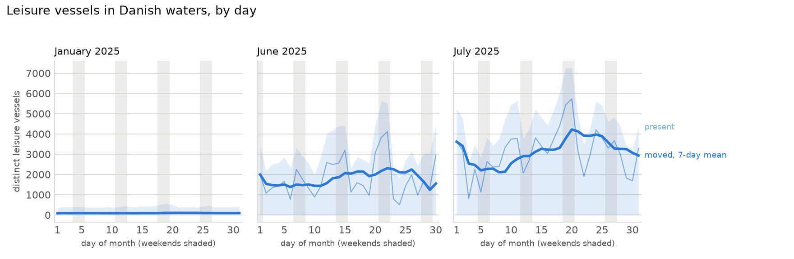
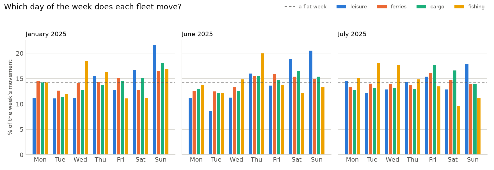
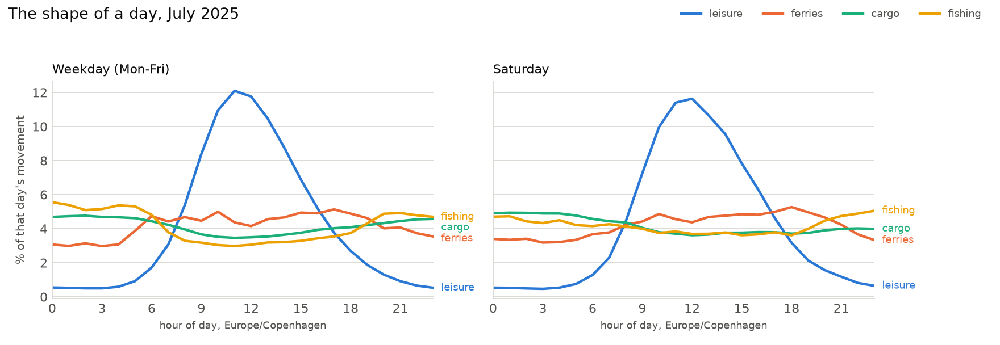

# S3 — Phase 0: three months, three shapes

92 whole days of 2025 — all of January, June and July — loaded into the
aggregates: **1 878 644 705 rows read, 1 735 448 756 kept**, 1.5 GB of store,
zero raw files left on disk.

Every number below comes from a query file in `sql/` run through
`scripts/ch.sh`; the three charts and the numbers in this note are produced by
one command:

```bash
uv run --project notes notes/plot.py
```

Charts read `sql/10_season_daily.sql`, `sql/11_week_profile.sql` and
`sql/12_day_profile.sql` respectively. **What counts as a boat being out:**
`moving_msgs > 0` — see `docs/DECISIONS.md`, 2026-08-30 (S3). `present` counts
every leisure vessel that reported a position; `active` / "moved" counts those
that exceeded 0.5 kn.

---

## 1. The season



*`sql/10_season_daily.sql`. Class B only. Shaded area = present, thin line =
moved that day, bold = 7-day mean of moved. Weekends shaded grey.*

| month | days | mean present/day | mean moved/day | share that moved | max moved |
|---|---|---|---|---|---|
| January 2025 | 31 | 409 | **96** | **23.5 %** | 140 (Jan 19) |
| June 2025 | 30 | 3 180 | 1 819 | 57.2 % | 4 121 (Jun 22) |
| July 2025 | 31 | 4 594 | **3 109** | **67.7 %** | 5 729 (Jul 20) |

**Finding 1 — the season has two different sizes, and the chart must say which
one it means.** Counting transponders that reported a position, the July fleet
is **11.2×** the January fleet. Counting boats that actually moved, it is
**32.4×**. Both are computed from the same 92 days by the same query; they
differ because **in January only 23.5 % of the leisure vessels present ever
exceed 0.5 kn, against 67.7 % in July.** Winter Denmark is mostly boats in a
marina with the electronics left on. This is why `sql/10_season_daily.sql`
carries both columns and why `docs/DECISIONS.md` refuses a bare "boats" count.

S1's 8.6× is confirmed, not corrected: measured on whole months, June against
January on the *present* count is 7.8×, and S1 had 8.6× from two single days.
Its measure was right; it is only the *moved* count that is three times larger.

The January panel is not empty, and that is itself a finding: **a floor of
about 96 vessels moves every single day of the Danish winter**, never dipping
below 79. Whatever they are — winter sailors, liveaboards, workboats
registered as pleasure craft — they are not a rounding error, and chapter 01
should say who they are rather than draw a season that starts at zero.

---

## 2. The week



*`sql/11_week_profile.sql`. Share of a typical week's moving messages,
averaged per occurrence of each weekday. Dashed line = 1/7, a week with no
rhythm. Normalised within each fleet: only shapes compare, never heights.*

Leisure (Class B), weekend ÷ weekday:

| month | Mon | Tue | Wed | Thu | Fri | Sat | Sun | ratio |
|---|---|---|---|---|---|---|---|---|
| January | 11.2 | 11.1 | 11.2 | 15.5 | 12.7 | 16.7 | 21.6 | **1.55×** |
| June | 11.2 | 8.6 | 11.3 | 16.0 | 13.6 | 18.8 | 20.5 | **1.62×** |
| July | 14.5 | 12.1 | 12.9 | 14.3 | 15.4 | 12.9 | 17.9 | **1.11×** |

**Finding 2 — the weekend effect is strongest when the fleet is smallest.**
The expected story is "summer = weekends"; the data says the opposite. June
and January have a pronounced weekend (1.62× and 1.55×), and **July, the peak
month, is nearly flat at 1.11×**. The obvious reading is the Danish holiday:
in July people are not sailing on their day off, they are on holiday and sail
on a Tuesday. No other fleet does this — ferries sit at 1.01× in July and
1.03× in January, cargo at 1.10× and 1.24×.

**Finding 3 — Saturday is not the peak day, Sunday is, and Saturday is the
least predictable day of the week.** July 2025, distinct leisure vessels that
moved, per weekday:

| | Mon | Tue | Wed | Thu | Fri | Sat | Sun |
|---|---|---|---|---|---|---|---|
| mean | 3 084 | 2 626 | 2 841 | 3 157 | 3 559 | **2 986** | **3 690** |
| min | 2 366 | 1 827 | 1 687 | 803 | 2 266 | **1 132** | 2 636 |
| max | 3 810 | 3 616 | 3 339 | 4 214 | 4 399 | **5 439** | 5 729 |

The mean Saturday (2 986) is *below* the mean Monday, and its range —
1 132 to 5 439, a factor of 4.8 — is the widest of any weekday. **This confirms
S1's warning with numbers.** S1 picked 2025-07-12 (Sat) and 2025-07-16 (Wed)
and found the Saturday lower; that was not a fluke of two days, it is what a
single Saturday is worth as evidence. Weather decides a Saturday; nothing
decides a Monday.

---

## 3. The day



*`sql/12_day_profile.sql`. Hour of day in Europe/Copenhagen. Share of that
day's moving messages, normalised within each fleet.*

**Finding 4 — leisure has a shape and the working fleets do not.** July
weekday, share of the day's movement in the single busiest hour, and the share
falling in the night (22:00–05:00):

| fleet | peak hour (local) | that hour | night 22–05 |
|---|---|---|---|
| leisure (Class B) | **11:00** | **12.1 %** | **3.8 %** |
| ferries (Class A) | 17:00 | 5.1 % | 22.5 % |
| cargo (Class A) | 02:00 | 4.8 % | 32.7 % |
| fishing (Class A) | 00:00 | 5.6 % | 36.0 % |

A flat day would put 4.17 % in each hour. Ferries, cargo and fishing are
within a percentage point of flat all day; **leisure puts three times the flat
share into midday and almost nothing into the night.** Cargo and fishing peak
*at night*. The four fingerprints are distinguishable by eye, which is what
chapter 02 needs.

The Saturday panel is the same shape as the weekday panel, an hour later
(peak 12:00 against 11:00) and slightly broader — more evidence for finding 2.
Sunday's night share is the lowest of all at 3.5 %.

---

## 4. The regattas — a negative result

**Finding 5 — neither Sjælland Rundt nor Kiel Week is visible in a national
daily count.** June 2025, distinct leisure vessels that moved:

| weekend | Sat | Sun |
|---|---|---|
| Jun 7–8 | 2 248 | 1 760 |
| **Jun 14–15 · Sjælland Rundt** | 2 567 | 3 199 |
| **Jun 21–22 · Kiel Week opens** | 3 826 | 4 121 |
| Jun 28–29 · Kiel Week closes | 1 673 | 1 338 |

Against the same weekday two weeks either side, Sjælland Rundt's Sunday is
**+9 %** (3 199 against a 2 941 mean) and its Saturday is *below* the
comparison (2 567 against 3 037). Kiel Week's opening weekend is the month's
maximum, but its closing weekend is the month's *minimum* — so the pattern is
weather, not the regatta. Given finding 3's Saturday range of 4.8×, a +9 %
national signal is not a signal.

This does not say the regatta is invisible; it says **a national daily count is
the wrong instrument**, and `sql/22_regatta_spikes.sql` in S6 — which compares
the race region's own cells against the same weekday ±2 weeks — is the right
one. Recorded here so S6 does not repeat the national query and conclude the
same thing.

---

## 5. Coverage, and what it costs to store

**Finding 6 — the out-of-bbox share swings from 55 rows to 4.70 % between
days.** Over the 92 days, `load_log` reports 6.82 % of rows dropped as
non-vessel (AtoN, base stations, SAR), 0.29 % at the `Latitude = 91` sentinel
and **0.51 % outside the Danish bbox — but that last one ranges from 55 rows
(2025-01-08, 0.0004 % of 15.1 M) to 4.70 % (2025-06-30)** — four orders of
magnitude. S1 saw a sevenfold swing across four days and told S10 to report
it; across 92 days it is far wider than that. The four counters partition `rows_read` exactly on all
92 rows.

**Finding 7 — 16.3 MB of store per day.** 1.5 GB for 92 days: 21.6 M rows in
`h3_hourly`, 535 k in `vessel_day`, 19.1 M in `public_track`. Straight-lined,
**S4's option (a) — 2024-03 → today, ~900 days — is ~15 GB**, comfortably
inside the 70 GB budget. Option (b), the full 2014 → 2026 archive at ~4 400
days, extrapolates to ~72 GB and would break it — but that number is an
overestimate, because 2025 has far more transponders per day than 2015 does.
Gate B2's scope decision has a real number under it, and the honest version of
option (b) needs one reference month from 2015 measured before it is chosen.

---

## 6. What this session found out about the loader

**Finding 8 — `clickhouse local -q "INSERT INTO t SELECT <constants>"` writes
one row per line of whatever is on stdin.** After 92 files, `load_log` held
8 919 rows for 92 archives — 98 exact duplicates each, one per line of
`queues/phase0.txt`, because `scripts/run_queue.sh` runs its loop as
`done < "$q"` and `scripts/ch.sh` passed the caller's stdin straight through.

Reproduced in isolation: the identical INSERT emits 1 row with stdin on
`/dev/null` and 98 with stdin on a 98-line file.

The aggregates were never affected — they are written through `ch.sh`'s *file*
branch, whose stdin is the SQL file — and this was verified rather than
assumed: `sum(msgs)` over `h3_hourly` equals `sum(rows_kept)` over `load_log`
to the row (1 735 448 756), `vessel_day` has 534 827 rows for 534 827 distinct
`(day, mmsi)`, and `public_track` has 19 148 484 rows for as many distinct
`(mmsi, ts)`. Only `load_log` was damaged and only by exact copies, so
`OPTIMIZE TABLE load_log FINAL DEDUPLICATE` restored it to 92 rows.

Fixed with one redirect in `scripts/ch.sh`, where every caller routes through,
and pinned by `scripts/test_load.sh` assert 13 — verified to fail without the
fix ("expected 1, got 3").

---

## Gate B2 — the reading

Three of the four shapes are unmistakable and one is absent:

- the season (32×) — **readable**
- the day (leisure 12.1 % in one hour and 3.8 % at night against three fleets
  that are flat) — **readable, and the most striking of the three**
- the week — **readable, and it says the opposite of what was expected**
- the regattas — **not present at this grain**; needs S6's spatial query

The human's call on the PNGs decides the gate and the scope of phase 1.
